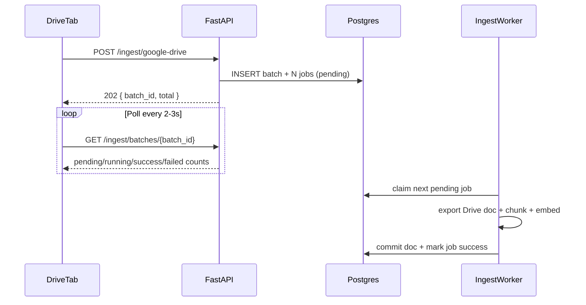

# Async ingest jobs — phased plan

## Problem

Today every ingest path blocks the HTTP connection until chunk + embed + DB commit finish ([`ingest_text`](app/main.py) → [`index_document`](app/indexing.py)). [`POST /ingest/google-drive`](app/main.py) exports and ingests **all selected docs sequentially in one request** — a few hundred docs will exceed Render’s ~30–100s proxy limit.

Existing [`JobStore`](app/job_store.py) + [`worker_loop`](app/worker.py) are **not a fix**: `create_job()` is never called, jobs are in-memory only, and the worker runs **LLM Q&A**, not indexing.

## End-state architecture



---

## Phase 1 — Backend foundation (tackle first)

**Goal:** Bulk Drive ingest no longer blocks HTTP. Callers get a `batch_id` immediately; work continues in a background loop. Verifiable with curl/Postman before any frontend changes.

**In scope**

| Deliverable | Details |
|-------------|---------|
| DB migration | `ingest_batches` + `ingest_jobs` tables (see schema below) |
| [`app/db.py`](app/db.py) helpers | `create_ingest_batch`, `insert_ingest_jobs`, `claim_next_ingest_job` (SKIP LOCKED), `finish_ingest_job`, `get_ingest_batch`, `refresh_batch_counts` |
| [`app/ingest_jobs.py`](app/ingest_jobs.py) | Pydantic models: `IngestBatchEnqueueResponse`, `IngestBatchStatusResponse` |
| [`app/drive_client.py`](app/drive_client.py) | New `export_drive_doc(file_id) -> DriveDoc` extracted from bulk export logic |
| [`app/ingest_worker.py`](app/ingest_worker.py) | `ingest_worker_loop(pool)` + `process_ingest_job` |
| [`app/main.py`](app/main.py) | Enqueue endpoint + batch status route + lifespan swap |
| Stale re-index | Worker reindexes when Drive `modifiedTime > source_modified_at`; skips when already up to date |
| Manual smoke test | Document curl steps in plan (below) |

**Out of scope for Phase 1**

- Frontend changes ([`DriveTab.tsx`](frontend/src/components/drive/DriveTab.tsx) still calls sync endpoint shape — **will break until Phase 2**; acceptable if Phase 1 is deployed backend-only or tested via API)
- Automated test suite (Phase 3)
- Docs / `.env.example` updates (Phase 3)
- Deleting [`app/job_store.py`](app/job_store.py) / [`app/worker.py`](app/worker.py) (Phase 3 cleanup)
- `GET /ingest/jobs/{job_id}` (optional; add in Phase 2 if UI needs per-doc errors)
- Multi-PDF batch, separate Render worker, webhooks (Phase 4+)

**Phase 1 success criteria**

1. `POST /ingest/google-drive` returns **202** within seconds with `{ batch_id, total }` even for 100+ file IDs.
2. `GET /ingest/batches/{batch_id}` shows counters moving: `pending` → `running` → `succeeded` / `failed` / `skipped`.
3. Documents appear in `GET /documents` as jobs complete (poll batch until `status: completed`).
4. Stale Drive docs are re-indexed, not skipped.
5. App restart mid-batch: pending jobs resume (Postgres-backed queue).

### Phase 1 — Database schema

Migration: [`supabase/migrations/20260528120000_ingest_jobs.sql`](supabase/migrations/20260528120000_ingest_jobs.sql)

```sql
CREATE TABLE ingest_batches (
  id UUID PRIMARY KEY DEFAULT gen_random_uuid(),
  kind TEXT NOT NULL,
  status TEXT NOT NULL DEFAULT 'pending',
  total INT NOT NULL DEFAULT 0,
  pending INT NOT NULL DEFAULT 0,
  running INT NOT NULL DEFAULT 0,
  succeeded INT NOT NULL DEFAULT 0,
  failed INT NOT NULL DEFAULT 0,
  skipped INT NOT NULL DEFAULT 0,
  created_at TIMESTAMPTZ NOT NULL DEFAULT now(),
  updated_at TIMESTAMPTZ NOT NULL DEFAULT now()
);

CREATE TABLE ingest_jobs (
  id UUID PRIMARY KEY DEFAULT gen_random_uuid(),
  batch_id UUID NOT NULL REFERENCES ingest_batches(id) ON DELETE CASCADE,
  status TEXT NOT NULL DEFAULT 'pending',
  kind TEXT NOT NULL,
  doc_id TEXT NOT NULL,
  payload JSONB NOT NULL,
  result JSONB,
  error TEXT,
  attempts INT NOT NULL DEFAULT 0,
  created_at TIMESTAMPTZ NOT NULL DEFAULT now(),
  updated_at TIMESTAMPTZ NOT NULL DEFAULT now()
);

CREATE INDEX idx_ingest_jobs_status_created ON ingest_jobs(status, created_at);
CREATE INDEX idx_ingest_jobs_batch ON ingest_jobs(batch_id);
```

Job payload shape: `{ "drive_file_id": "...", "title": "...", "drive_modified_unix": 1234567890 }`

### Phase 1 — Worker behavior

Replace dead LLM [`worker_loop`](app/worker.py) in [`lifespan`](app/main.py) with `ingest_worker_loop(db_pool)`.

| Case | Action |
|------|--------|
| `doc_id` not in DB | `ingest_text` path (insert + `index_document`) |
| Row exists + Drive newer than `source_modified_at` | Update `full_text`/metadata from export, then `reindex_document` |
| Row exists + up to date | Mark job **skipped** |

- **Concurrency:** one job at a time (simple, rate-limit friendly).
- **Connections:** one pool connection per job; commit per job.
- **Export:** inside worker via `export_drive_doc`, not during HTTP enqueue.

### Phase 1 — API changes

**`POST /ingest/google-drive`** (breaking change vs today):

1. List file metadata only (fast — no export on HTTP path).
2. Insert batch + N pending jobs.
3. Return **202** + `IngestBatchEnqueueResponse`.

**New: `GET /ingest/batches/{batch_id}`**

Returns aggregate counts + batch `status` (`pending` | `running` | `completed` | `failed`).

**Unchanged (sync):** `POST /ingest/file`, `POST /ingest`, `POST /documents/{doc_id}/reindex`.

### Phase 1 — Manual smoke test

After migration + deploy locally:

```bash
# 1. Enqueue (expect 202 + batch_id)
curl -s -X POST "$API/ingest/google-drive" \
  -H "Authorization: Bearer $TOKEN" \
  -H "Content-Type: application/json" \
  -d '{"file_ids":["<drive_file_id_1>","<drive_file_id_2>"]}'

# 2. Poll until completed
curl -s "$API/ingest/batches/<batch_id>" -H "Authorization: Bearer $TOKEN"

# 3. Confirm docs indexed
curl -s "$API/documents" -H "Authorization: Bearer $TOKEN"
```

Start with 2–3 docs, then a folder of ~10, before loading hundreds.

---

## Phase 2 — Frontend polling

**Goal:** Drive tab works again with async ingest and shows progress.

| Deliverable | Details |
|-------------|---------|
| [`frontend/src/types/index.ts`](frontend/src/types/index.ts) | `IngestBatchEnqueueResponse`, `IngestBatchStatusResponse` |
| [`frontend/src/api/drive.ts`](frontend/src/api/drive.ts) | Handle 202; add `getIngestBatchStatus(batchId)` |
| [`frontend/src/components/drive/DriveTab.tsx`](frontend/src/components/drive/DriveTab.tsx) | Poll every 2–3s; show live counts; refresh list + documents on completion |
| Optional | `GET /ingest/jobs/{job_id}` if per-row errors needed in UI |

[`UploadDropzone.tsx`](frontend/src/components/documents/UploadDropzone.tsx) stays sync (single PDF).

**Phase 2 success criteria:** User can select 50+ Drive files, click Ingest, see progress, and get updated badges when done — without browser timeout.

---

## Phase 3 — Tests, docs, cleanup

| Deliverable | Details |
|-------------|---------|
| [`tests/test_ingest_jobs.py`](tests/test_ingest_jobs.py) | Batch counters, stale vs skip logic, SKIP LOCKED claim |
| [`.env.example`](.env.example) | `INGEST_WORKER_ENABLED=1` kill switch (optional) |
| [`setup_and_testing.md`](setup_and_testing.md) | 202 + polling contract, smoke test steps |
| Cleanup | Remove unused LLM `JobStore` / `worker_loop` startup (or delete files) |

---

## Phase 4+ — Future (defer)

- Dedicated Render Background Worker service (same repo, shared `DATABASE_URL`)
- Multi-PDF batch upload UI + async jobs for `POST /ingest/file`
- Async `POST /documents/{doc_id}/reindex` for fleet re-embed
- `INGEST_WORKER_CONCURRENCY` > 1
- Webhooks on batch completion
- Redis / external queue

---

## Implementation order (Phase 1 only)

1. Migration + `app/db.py` helpers
2. `export_drive_doc` in `drive_client.py`
3. `app/ingest_worker.py` + wire in lifespan
4. Enqueue + `GET /ingest/batches/{id}` in `main.py`
5. Manual smoke test (2 docs → 10 docs)

**Do not start Phase 2 until Phase 1 smoke test passes.**

After Phase 1 + 2: run full folder ingest (~100+ docs), watch batch status and OpenAI embedding usage.
