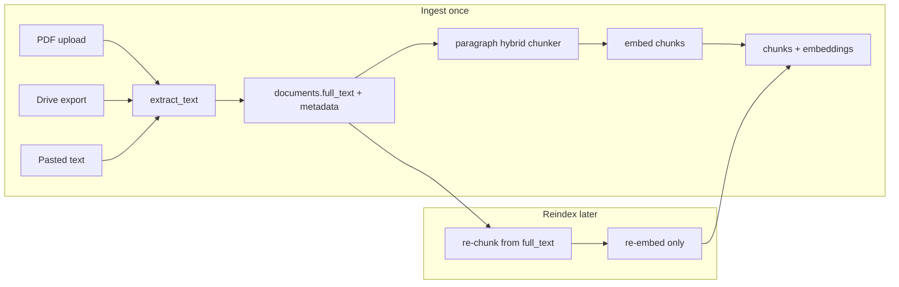

# Chunking strategy and future-proof ingest storage

## Recommendation: store text, not file paths

**Do not rely on filesystem paths** for re-chunking. Browser PDF uploads never have a stable server path; even CLI paths break when files move.

| Store | Purpose |
|-------|---------|
| **`documents.full_text`** (new) | Canonical extracted text — source of truth for re-chunk and re-embed |
| **`documents.source_filename`** (new) | Original upload filename or Drive doc name (display + dedup hints) |
| **`documents.source_url`** (existing) | Open original in Drive / SharePoint / external link |
| **`documents.source_modified_at`** (existing) | Detect stale Drive re-sync later |
| **`documents.chunking_config`** (new JSON) | `{strategy, chunk_size, chunk_overlap}` used at last index |
| **`documents.embedding_model`** (new) | Active model for this doc’s vectors |

Drive docs can be re-exported via `doc_id`, but **`full_text` is faster, offline-safe, and matches what was actually indexed** (important if PDF extraction quality changes later).



---

## 1. Schema migration

New Supabase migration (and matching idempotent blocks in [`app/db.py`](app/db.py) `create_db`):

**`documents` additions:**
- `full_text TEXT NOT NULL` — for new ingests; backfill empty for any legacy test rows (you can delete test docs instead)
- `source_filename TEXT`
- `chunking_config JSONB` — e.g. `{"strategy":"paragraph","chunk_size":1200,"chunk_overlap":150}`
- `embedding_model TEXT`

**`chunks` addition (optional but useful for citations):**
- `section_label TEXT` — detected heading for that chunk (e.g. `"Roof Damage"`), surfaced in SSE sources instead of raw `chunk_id`

**`embeddings` — model-aware retrieval:**
- Add `WHERE e.model = %s` in [`retrieve_top_k_pg`](app/db.py) using active model from `HttpEmbedder().model`
- Keep `chunk_id` as PK for now (single active vector per chunk; reindex replaces rows). Composite `(chunk_id, model)` can come later if you need zero-downtime dual-model migration.

Since you have only test data: **delete test documents and re-ingest** after migration rather than complex backfills.

---

## 2. Paragraph-first hybrid chunker

Replace/extend [`app/chunking.py`](app/chunking.py) (keep `Chunk` dataclass + offsets):

**Pipeline:**
1. **Normalize** — unify line endings; collapse 3+ newlines to 2; trim
2. **Split paragraphs** — on `\n\n+`
3. **Detect section headers** — lightweight heuristics on paragraph openers:
   - Numbered: `^\d+\.\s+[A-Z]`
   - ALL CAPS short lines
   - Title-case lines under ~80 chars ending without period
   - Attach detected label to subsequent chunks until next header
4. **Merge paragraphs** into chunks until adding the next paragraph would exceed `chunk_size` (default **1200** chars, overlap **150** — better for narrative reports than current 800/100)
5. **Oversized paragraphs** — sentence-split on `(?<=[.!?])\s+` with overlap; never hard-split mid-word
6. **Prefix context** — prepend `[Section: {label}]` to chunk text when label exists (improves retrieval without storing duplicate metadata only in DB)

Update [`ChunkingOptions`](app/models.py): add `strategy: Literal["paragraph", "chars"]` (default `"paragraph"`); keep `chars` as fallback for tests.

Add unit tests in `tests/test_chunking.py` covering: multi-paragraph merge, long paragraph sentence split, section header detection, overlap continuity.

---

## 3. Refactor ingest pipeline

Centralize in [`app/main.py`](app/main.py) (or new `app/indexing.py`):

```python
# conceptual split
async def ingest_text(...):
    insert_document(..., full_text=text, source_filename=..., chunking_config=..., embedding_model=...)
    await index_document(conn, doc_id, text, chunking_options, embedder)

async def index_document(conn, doc_id, text, opts, embedder):
    # delete existing chunks+embeddings for doc_id if reindex
    chunks = chunk_text_paragraph_hybrid(text, opts)
    insert chunks + embeddings
    update documents.embedding_model
```

**Wire metadata at each entry point:**
- [`POST /ingest/file`](app/main.py) — pass `filename` as `source_filename`
- [`POST /ingest/google-drive`](app/main.py) — pass Drive `title` as `source_filename`; keep `source_url`
- [`POST /ingest`](app/main.py) — optional `source_filename` field on `IngestRequest`

Update [`insert_document`](app/db.py) and [`list_documents`](app/db.py) to read/write new columns. Expose `embedding_model`, `source_filename`, and `chunking_config` on [`DocumentSummary`](app/models.py) / frontend types (Documents tab only — no UI overhaul).

---

## 4. Reindex capability

Add `reindex_document(conn, doc_id, user_id, chunking_options=None)`:
1. Load `full_text` + ownership check
2. Delete chunks + embeddings for `doc_id` (reuse cascade or explicit deletes from [`delete_by_doc_id`](app/db.py))
3. Run `index_document` with current or overridden chunking options
4. Update `chunking_config` + `embedding_model`

Expose as **`POST /documents/{doc_id}/reindex`** (auth + user ownership). Optional body to override chunk_size/overlap for experiments.

No UI button required in this pass; curl/admin use is enough until bulk migration UI is needed.

---

## 5. Retrieval and citations

- Pass active embed model into [`retrieve_top_k`](app/retrieval.py) / `retrieve_top_k_pg` — prevents mixed-model search when config changes
- In [`_sources_payload_for_sse`](app/main.py), use `section_label` when present instead of `chunk_id` in the `section` field

---

## 6. Config defaults

In [`app/config.py`](app/config.py) (or keep on `ChunkingOptions` defaults):
- `CHUNK_SIZE` default **1200**, `CHUNK_OVERLAP` **150**
- Document chosen values in [`code-notes.md`](code-notes.md) under the previously empty “Chunking strategy for reports” note

---

## 7. Out of scope (follow-ups)

- Storing original PDF binaries (only needed for download-from-app, not re-chunk)
- `.docx` ingest (noted in [`code-notes.md`](code-notes.md) but not implemented)
- Dual-model embeddings table / background fleet re-embed job (add when you actually switch models at scale)
- Drive “re-sync if modifiedTime changed” job

---

## Test plan

1. Apply migration; wipe test documents
2. Ingest a multi-section pasted report → verify chunk count, section labels, `full_text` stored
3. Upload PDF → verify `source_filename` matches upload name
4. Ingest Drive doc → verify `source_url` + `source_filename`
5. `POST /documents/{doc_id}/reindex` with different `chunk_size` → chunk count changes, `full_text` unchanged, search still works
6. Change `EMBED_MODEL` in env, reindex one doc → retrieval only returns vectors for active model
