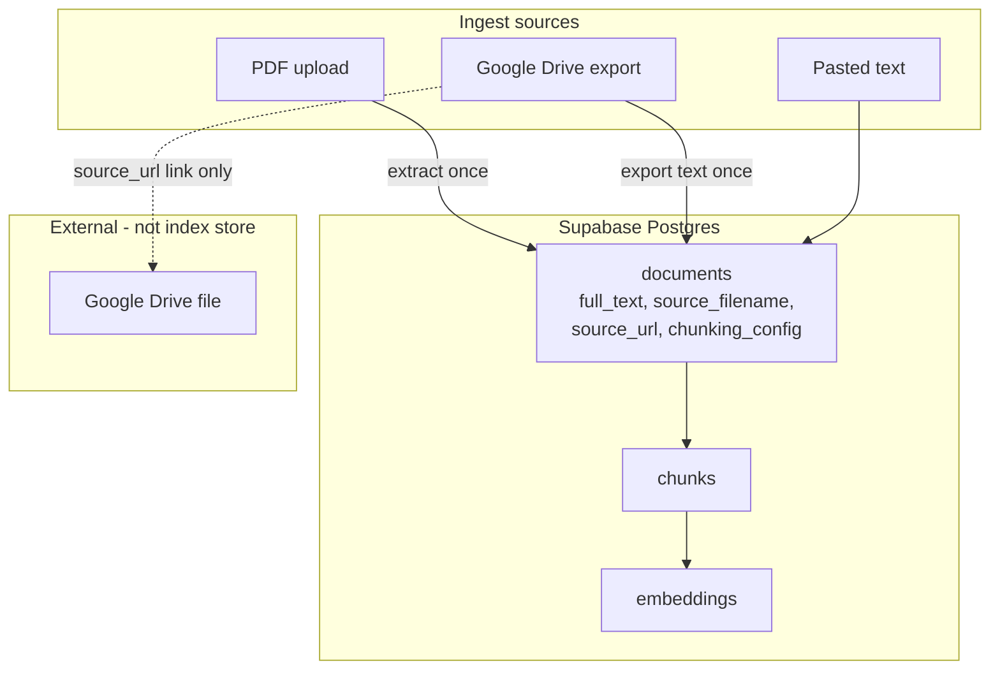

# Chunking strategy and future-proof ingest storage

## Storage decision: Supabase Postgres (not Google Drive)

**Extracted text lives in Supabase**, in a new `documents.full_text` column on the existing `documents` table — same Postgres database you already use for chunks and embeddings.

| What | Where | Why |
|------|-------|-----|
| **Extracted full text** | Supabase `documents.full_text` | Fast re-chunk/re-embed; no external dependency; same DB as RAG |
| **Chunks + embeddings** | Supabase (unchanged) | Already there |
| **Original PDF file** | Not stored (unchanged) | Only text is extracted at upload; bytes discarded |
| **Google Drive original** | Stays in Drive | We only export plain text at ingest; `source_url` links back to open it |
| **Original filename** | Supabase `documents.source_filename` | Display + dedup; not a filesystem path |

**Why not store text on Google Drive?**

- Drive is a **source**, not your index store — re-chunking would require re-export API calls for every document.
- Files can be deleted, trashed, or permission-revoked; your index would break.
- Extracted text is already in Postgres as chunk content; storing `full_text` alongside metadata is consistent and simpler.
- Your shared-library model ([shared_library_feasibility plan](shared_library_feasibility_3f819ba4.plan.md)) assumes one global corpus in Postgres — Drive folders are per-user/org and not a good canonical store.

**Scale note:** Plain-text reports (typically tens of KB each) fit comfortably in Postgres TEXT. Thousands of reports is fine. If the corpus grows to tens of GB of raw text, a later optimization could move `full_text` to **Supabase Storage** (object blobs) and keep a pointer on `documents` — not needed for initial real ingest.

**What we do not store:** Original PDF binaries. If download-from-app is needed later, that would be Supabase Storage or always linking via `source_url` — separate feature.

---

## Recommendation: store text, not file paths

**Do not rely on filesystem paths** for re-chunking. Browser PDF uploads never have a stable server path.

| Store | Purpose |
|-------|---------|
| **`documents.full_text`** | Canonical extracted text — source of truth for re-chunk and re-embed |
| **`documents.source_filename`** | Original upload filename or Drive doc name |
| **`documents.source_url`** (existing) | Open original in Drive / SharePoint / external link |
| **`documents.source_modified_at`** (existing) | Detect stale Drive re-sync later |
| **`documents.chunking_config`** (JSON) | `{strategy, chunk_size, chunk_overlap}` used at last index |
| **`documents.embedding_model`** | Active model for this doc's vectors |

---

## 1. Schema migration

New Supabase migration (and matching idempotent blocks in [app/db.py](app/db.py) `create_db`):

**`documents` additions:**
- `full_text TEXT NOT NULL` — for new ingests; delete test docs rather than backfill
- `source_filename TEXT`
- `chunking_config JSONB`
- `embedding_model TEXT`

**`chunks` addition:**
- `section_label TEXT` — detected heading for citations

**`embeddings` — model-aware retrieval:**
- Add `WHERE e.model = %s` in `retrieve_top_k_pg` using active model from `HttpEmbedder().model`

---

## 2. Paragraph-first hybrid chunker

Replace/extend [app/chunking.py](app/chunking.py):

1. Normalize whitespace
2. Split paragraphs on blank lines
3. Detect section headers (numbered, ALL CAPS, title-case short lines)
4. Merge paragraphs to target size (default **1200** chars, overlap **150**)
5. Sentence-split oversized paragraphs with overlap
6. Prefix `[Section: {label}]` when label exists

Update [ChunkingOptions](app/models.py): `strategy: Literal["paragraph", "chars"]` (default `"paragraph"`).

Add `tests/test_chunking.py`.

---

## 3. Refactor ingest pipeline

Split into `ingest_text` (save document + metadata) and `index_document` (chunk + embed).

Wire `source_filename` at PDF upload, Drive ingest, and optional field on `POST /ingest`.

---

## 4. Reindex capability

`POST /documents/{doc_id}/reindex` — re-chunk from `full_text`, re-embed, no re-upload.

---

## 5. Retrieval and citations

- Filter retrieval by active embedding model
- Use `section_label` in SSE sources when present

---

## 6. Out of scope

- PDF binary storage (Supabase Storage — later if needed)
- `.docx` ingest
- Dual-model embeddings / fleet re-embed job
- Drive re-sync on modifiedTime change

---

## Test plan

1. Apply migration; wipe test documents
2. Ingest multi-section report → verify `full_text`, section labels, chunks
3. Reindex with different chunk_size → chunk count changes, text unchanged
4. Confirm retrieval respects active embedding model
