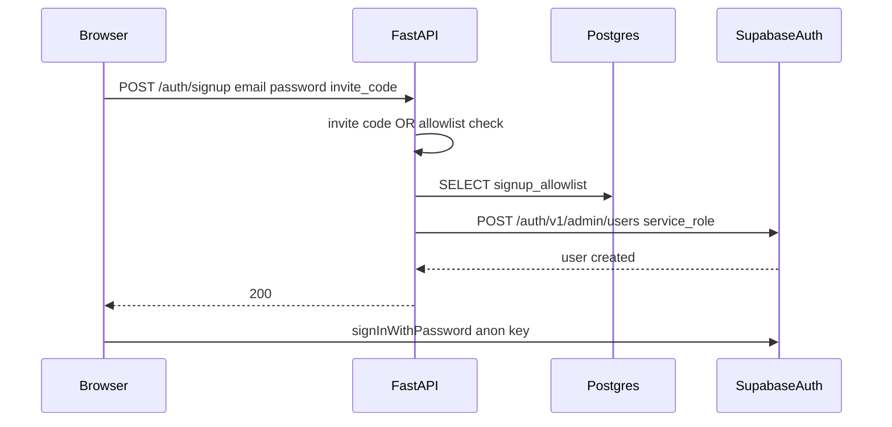

# Closed signup (allowlist + optional shared code)

## Why this shape

Today, [`static/index.html`](static/index.html) calls `supabase.auth.signUp` directly ([lines 783–801](static/index.html)). Anyone with the anon key can create users unless Supabase-level signup is turned off. The reliable pattern is:

1. **Turn off** “Allow new users to sign up” under Supabase **Project Settings → Authentication** (blocks `signUp` on the public Auth API).
2. **Create users** only from your trusted server with the **service role** key via GoTrue Admin: `POST /auth/v1/admin/users`.

Your app already has **Postgres** via [`DATABASE_URL`](app/config.py) and runs DDL in [`create_db`](app/db.py), so an allowlist table is natural—no extra Supabase Edge Function unless you prefer that later.

## Access rule (OR, as you asked)

- **Allow** if `SIGNUP_INVITE_CODE` is set in the server environment **and** the request body includes the same code (constant-time compare, e.g. `secrets.compare_digest`).
- **Else allow** if a row exists in **`signup_allowlist`** for the normalized email (store/compare **lowercased** email).
- **Else** `403` with a generic message (avoid leaking whether the email is on the list).

If `SIGNUP_INVITE_CODE` is **unset/empty**, only the allowlist path applies (invite field in the UI can be optional).

## Database

- New table `signup_allowlist` with at least `email TEXT PRIMARY KEY` (values stored lowercase). Optional: `created_at`, `note` for admin context.
- Add it in both places you maintain schema:
  - New file under [`supabase/migrations/`](supabase/migrations/) (for Supabase-managed deploys).
  - [`create_db`](app/db.py) `CREATE TABLE IF NOT EXISTS` block (for app-first boot / consistency with `documents` pattern).
- **RLS**: `ALTER TABLE signup_allowlist ENABLE ROW LEVEL SECURITY;` with **no** policies for `anon` / `authenticated` so the Data API cannot read the list. Server connections using the DB owner role used in `DATABASE_URL` still work for checks.

## Backend (FastAPI)

- [`app/config.py`](app/config.py): `SUPABASE_SERVICE_ROLE_KEY` (server-only), `SIGNUP_INVITE_CODE` (optional).
- New route e.g. **`POST /auth/signup`** in [`app/main.py`](app/main.py) (or small `app/signup.py` imported there):
  - Body: `email`, `password`, optional `invite_code`.
  - Validate password length (minimal sanity); normalize email.
  - Check allowlist with a single `SELECT 1 FROM signup_allowlist WHERE email = %s` on the existing pool (`with_db_conn_retry_sync` pattern).
  - If allowed, call Supabase Admin API with **`httpx`** (already in [`requirements.txt`](requirements.txt)):  
    `POST {SUPABASE_URL}/auth/v1/admin/users`  
    Headers: `apikey`, `Authorization: Bearer` both set to service role; body e.g. `email`, `password`, and `email_confirm: true` if you want immediate sign-in without confirm email (align with your current Email provider settings).
  - Map “user already registered” style errors to a safe `400/409` message.
- **Do not** expose service role via [`GET /config`](app/main.py); keep returning only anon key + URL.

## Frontend

- [`static/index.html`](static/index.html): add optional **Invite code** field on the sign-in form (or only visible when `/config` advertises invite mode—optional `signup_invite_enabled` boolean from config).
- Replace the **Sign up** button handler: `fetch(getApiBase() + '/auth/signup', { method: 'POST', headers: { 'Content-Type': 'application/json' }, body: JSON.stringify({ email, password, invite_code }) })`, then on success call **`signInWithPassword`** (same as sign-in) so the user gets a session without embedding the service role in the browser.

## Admin workflow

- **Per-email**: `INSERT INTO signup_allowlist (email) VALUES (lower('user@example.com')) ON CONFLICT DO NOTHING;` in SQL Editor (or Table Editor).
- **Shared code**: set `SIGNUP_INVITE_CODE` in the app environment (Render/local `.env`); anyone with the code can register **any** email—acceptable for a private beta if you trust code distribution.

## Operational checklist (after code lands)

1. Add `SUPABASE_SERVICE_ROLE_KEY` to server env (never commit; never `NEXT_PUBLIC_` / client).
2. Supabase dashboard: **disable** public user signups.
3. Create allowlist rows and/or set invite code.
4. Confirm Email provider settings still match how you set `email_confirm` on admin create.

## Optional later improvements (out of scope unless you want them)

- Remove allowlist row after successful signup (true one-time invite).
- Rate-limit `POST /auth/signup` to reduce brute force on invite codes.
- Supabase **Before User Created** hook instead of disabling public signup—more infrastructure, same guarantee.
