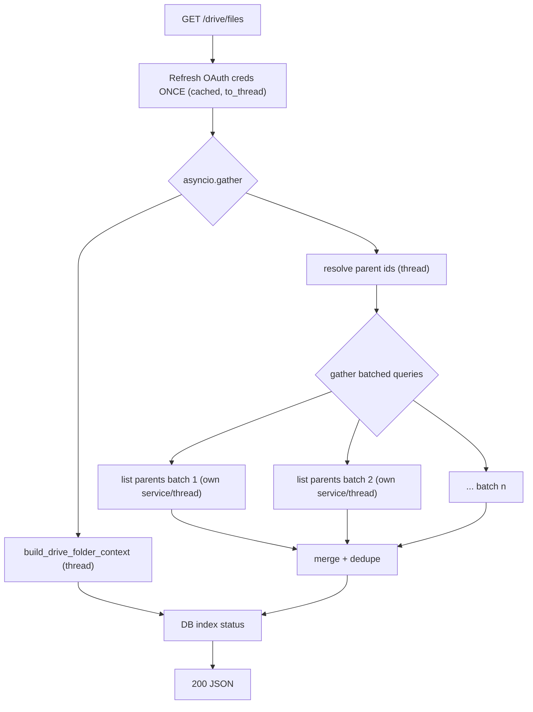

## Goal

Stop the single event loop from freezing on Drive calls, and cut the wall-clock time of listing large folders (209 files) so the request completes well under Render's proxy timeout. Root causes confirmed in the codebase:

- All four Drive endpoints run synchronous `googleapiclient` calls directly inside `async def` (blocks the one worker).
- `_get_credentials()` does a network OAuth refresh on every call; `GET /drive/files` triggers it twice (in `build_drive_folder_context` and again in `list_docs_metadata`).
- `list_docs_metadata` runs sequentially: enumerate ~200 subfolders, then ~9 batched parent queries (`DRIVE_PARENTS_PER_QUERY = 25`).
- Frontend `driveListFiles` has no retry, so any timeout surfaces the red `HTTP 502` instantly.

### Target flow for `GET /drive/files`

## Thread-safety constraint (important)

`googleapiclient` service objects and `httplib2` are NOT thread-safe. So parallelization must: (1) refresh credentials ONCE up front, then (2) have each worker thread build its OWN `service` and only read the already-valid token. Never share one `service` across threads.

## Changes

### 1. Cache OAuth credentials — [`app/drive_client.py`](app/drive_client.py)
Replace per-call refresh in `_get_credentials()` (line 158) with a module-level cached `Credentials` guarded by a `threading.Lock`, refreshing only when `not creds.valid`. Reset cache to `None` on `RefreshError`. This removes the duplicate token-refresh round trips (the single biggest fixed cost per request).

### 2. Concurrency-friendly listing helpers — [`app/drive_client.py`](app/drive_client.py)
- Add `_build_service(creds)` using `build("drive", "v3", credentials=creds, cache_discovery=False)` (also quiets the `file_cache` log noise).
- Split `list_docs_metadata` (line 311) internals into reusable pieces: `_resolve_parent_ids(service, folder_id)` (folder + subfolders) and `_list_files_for_parents(creds, batch, fields)` which builds its own thread-local service.
- Add `async def list_docs_metadata_async(folder_id, file_ids)` that: refreshes creds once via `asyncio.to_thread`, resolves parent ids in a thread, then `asyncio.gather`s `asyncio.to_thread(_list_files_for_parents, ...)` over the batches. Keep the existing sync `list_docs_metadata` intact for the ingest worker path (`list_and_export_docs`, line 466).
- For full fan-out parallelism on small-CPU instances, run the Drive batches on a dedicated `ThreadPoolExecutor(max_workers=16)` rather than the default loop executor (which is ~cpu+4).

### 3. Offload all Drive endpoints — [`app/main.py`](app/main.py)
- `GET /drive/files` (line 614): run folder context and listing concurrently:
  `raw, folder_built = await asyncio.gather(list_docs_metadata_async(...), asyncio.to_thread(build_drive_folder_context, folder_id))`.
- `GET /drive/folder` (line 593): `await asyncio.to_thread(build_drive_folder_context, resolved)`.
- `GET /drive/test` (line 534): `await asyncio.to_thread(test_connection)`.
- `POST /ingest/google-drive` (line 658): `raw = await list_docs_metadata_async(...)`.
- Optional polish: wrap the sync psycopg2 body inside the `enrich`/`do_enqueue` closures in `asyncio.to_thread` for full async consistency (DB is local/fast, so low priority).

### 4. Frontend retry/backoff — [`frontend/src/api/drive.ts`](frontend/src/api/drive.ts) (+ optional helper in [`frontend/src/lib/api.ts`](frontend/src/lib/api.ts))
Add a small retry wrapper: on `502/503/504` or network error, retry up to 3 times with backoff (e.g. 1s, 2s) before throwing. Apply to `driveListFiles` (line 26) and `driveGetFolder` (line 16). The logs show retries already succeed, so this alone removes most user-visible 502s.

### 5. Infra recommendation (no change)
Keep a single uvicorn worker ([`Dockerfile`](Dockerfile) line 26). The `to_thread` offload lets one worker handle concurrent requests; multiple workers are safe (`SKIP LOCKED`) but would spawn duplicate ingest loops doing heavy downloads and raise memory. Revisit only if CPU-bound load grows.

## Verification
- List the 209-file `zFinished` folder repeatedly; confirm no 502 and a noticeably lower response time.
- Confirm a concurrent `GET /` / health check stays responsive while a large `GET /drive/files` is in flight.
- Confirm ingest via `POST /ingest/google-drive` still enqueues and the worker still fetches files (sync path untouched).
- Run existing Drive tests (e.g. [`tests/test_drive_ingest_mimes.py`](tests/test_drive_ingest_mimes.py), which patches `DRIVE_PARENTS_PER_QUERY`).