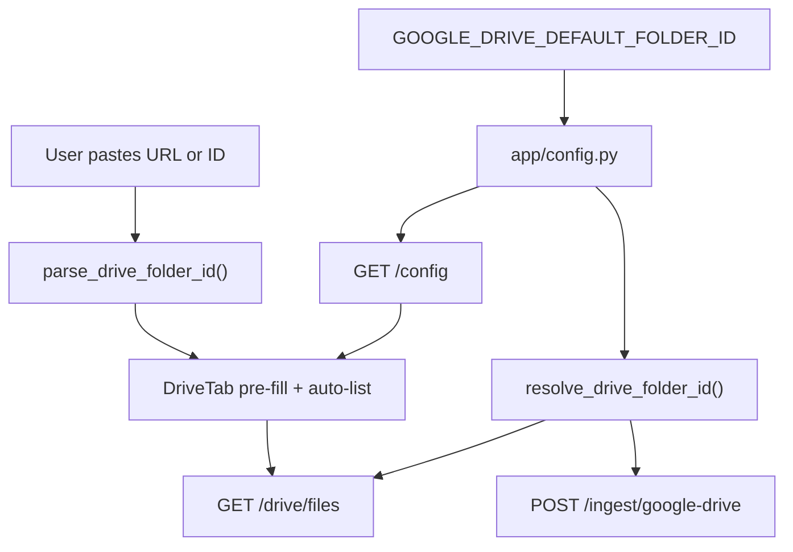

# Drive default inbox folder

## Goal

Team reports live in one shared Drive inbox. Operators set **`GOOGLE_DRIVE_DEFAULT_FOLDER_ID`** on Render/local `.env`; TrueAI opens the **Google Drive** tab scoped to that folder. Users paste a different folder URL only when intentionally ingesting elsewhere.

Your production inbox folder ID (from [Drive](https://drive.google.com/drive/folders/12FGnoHObEnFRQNEUHtHla2Ajx33xauhc)): `12FGnoHObEnFRQNEUHtHla2Ajx33xauhc` — **env only**, not hardcoded in app source.

**Auth prerequisite (ops, not code):** The Google account used for `GOOGLE_REFRESH_TOKEN` must have access to that folder (your boss shares the folder with that account, or OAuth is done as an account that owns it).



## Backend

### 1. Config — [`app/config.py`](app/config.py), [`.env.example`](.env.example)

Add:

```python
GOOGLE_DRIVE_DEFAULT_FOLDER_ID = _google_env("GOOGLE_DRIVE_DEFAULT_FOLDER_ID")
```

In `.env.example` under Google Drive section, document with commented example:

```bash
# Team inbox folder (ID or full drive.google.com/.../folders/... URL). Used when API/UI omit folder_id.
# GOOGLE_DRIVE_DEFAULT_FOLDER_ID=12FGnoHObEnFRQNEUHtHla2Ajx33xauhc
```

Add to [`setup.md`](setup.md) env table and Google Drive section.

### 2. Parse + resolve helpers — [`app/drive_client.py`](app/drive_client.py)

Add pure functions (unit-testable):

- **`parse_drive_folder_id(value: str | None) -> str | None`**
  - Accept raw ID or full URL (`/folders/{id}`)
  - Reject `/file/d/` (single doc) — return `None` or distinguish for error messaging
- **`resolve_drive_folder_id(explicit: str | None) -> str | None`**
  - If `explicit` parses to an ID → use it
  - Else if `GOOGLE_DRIVE_DEFAULT_FOLDER_ID` parses → use default
  - Else `None` (preserves today’s whole-Drive behavior only when no default configured)

Apply `parse_drive_folder_id` to env default at load time or at resolve time so admins can paste full URL into env too.

### 3. Wire defaults into API — [`app/main.py`](app/main.py)

**`GET /drive/files`:** Before `list_docs_metadata`, when `file_ids` is not set:

```python
folder_id = resolve_drive_folder_id(folder_id)
```

**`POST /ingest/google-drive`:** When `body.file_ids` is empty/null:

```python
folder_id = resolve_drive_folder_id(body.folder_id)
docs = list_and_export_docs(folder_id=folder_id, file_ids=body.file_ids)
```

When `file_ids` is provided, ignore folder (unchanged).

**`GET /config`:** Add public field (folder IDs are not secrets):

```python
"google_drive_default_folder_id": parse_drive_folder_id(GOOGLE_DRIVE_DEFAULT_FOLDER_ID) or ""
```

### 4. Tests — [`tests/test_drive_folder_id.py`](tests/test_drive_folder_id.py) (new)

Cases for `parse_drive_folder_id`:

- Raw ID
- Full `drive.google.com/drive/folders/{id}` URL
- URL with query params
- Empty / whitespace → `None`
- Doc URL `/document/d/` → `None` (or flagged invalid)

Cases for `resolve_drive_folder_id` with mocked/default env.

## Frontend

### 1. Types + config — [`frontend/src/context/AuthContext.tsx`](frontend/src/context/AuthContext.tsx)

Extend `PublicAppConfig` with `google_drive_default_folder_id: string` from `/config`.

### 2. Shared parse util — [`frontend/src/lib/driveFolder.ts`](frontend/src/lib/driveFolder.ts) (new)

Mirror backend parsing logic in TS:

- `parseDriveFolderInput(input: string): { id: string | null; error?: string }`
- `driveFolderUrl(id: string): string`

### 3. Drive tab UX — [`frontend/src/components/drive/DriveTab.tsx`](frontend/src/components/drive/DriveTab.tsx)

**Initial folder resolution** (on mount, after `publicConfig` available via `useAuth()`):

1. `localStorage` key `trueai_drive_folder_id` if set (user’s last explicit choice)
2. Else `publicConfig.google_drive_default_folder_id`
3. Else empty

**Input changes:**

- Label: **“Inbox folder (paste link or ID)”**
- Help text: team inbox is pre-configured; paste another folder URL to ingest elsewhere
- On blur/paste: parse URL → store normalized ID in state; show inline error if doc URL detected
- **Open in Drive** link when valid ID present
- **Reset to team inbox** button (visible when default exists and current value differs) — clears localStorage override and restores default

**Auto-list (per your choice):** On first mount when resolved folder ID is non-empty, call `listMutation.mutate()` once (guard with ref to avoid double-fetch in Strict Mode).

**Persist override:** When user edits folder field to a non-default value, save to `localStorage`; reset button clears it.

**Ingest/list:** Continue sending resolved ID via existing API client; backend also applies default as safety net when field sent empty.

## Documentation

Update briefly:

- [`setup.md`](setup.md) — env var + Render note to set on production
- [`setup_and_testing.md`](setup_and_testing.md) — inbox workflow, URL paste, sharing folder with OAuth account
- [`README.md`](README.md) — one line under Drive workflow

## Out of scope

- Similar-titles warnings on Drive ingest
- Recursive subfolder listing
- Hardcoding `12FGnoHObEnFRQNEUHtHla2Ajx33xauhc` in source (Render `.env` only)
- Per-user Drive OAuth / Google Picker

## Manual test plan

1. Set `GOOGLE_DRIVE_DEFAULT_FOLDER_ID=12FGnoHObEnFRQNEUHtHla2Ajx33xauhc` locally; restart API.
2. `curl /config` → includes `google_drive_default_folder_id`.
3. Open Drive tab signed in → field pre-filled, auto-lists (after OAuth + folder share works).
4. Paste full folder URL for a different folder → parses, lists that folder.
5. **Reset to team inbox** → back to default.
6. `curl /drive/files` with no query param → uses default folder, not whole Drive.
7. Ingest with selection → scoped to current folder; Documents tab updates.
