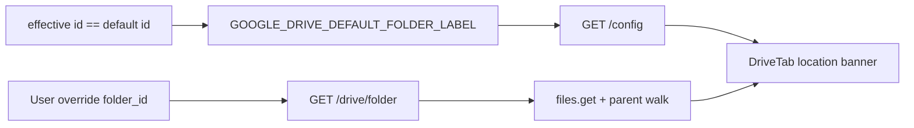

# Show default folder path in Drive tab

## Problem

The **Google Drive** tab resolves the team inbox from [`GOOGLE_DRIVE_DEFAULT_FOLDER_ID`](app/config.py) but only shows the opaque folder ID in the input (e.g. `1HUgl4ryKyijBOP4_nJkJCCT3mvLdKPih`). Operators cannot tell at a glance that they are in **Ready for AI Ingest** vs a custom override.

## Approach (hybrid, per your choice)

| Situation | Display source |
|-----------|----------------|
| Viewing team default inbox | Static label from new env **`GOOGLE_DRIVE_DEFAULT_FOLDER_LABEL`** (exposed in `GET /config`) |
| Viewing a custom override folder | One Drive API lookup for folder name (+ optional short parent breadcrumb) |



## Backend

### 1. Config — [`app/config.py`](app/config.py), [`.env.example`](.env.example)

Add optional env (no trailing semantics enforced; ops paste a friendly path):

```python
GOOGLE_DRIVE_DEFAULT_FOLDER_LABEL = _google_env("GOOGLE_DRIVE_DEFAULT_FOLDER_LABEL")
```

Document beside the existing inbox ID:

```bash
# Human-readable label shown in the Drive tab when viewing the team inbox (not a secret).
# GOOGLE_DRIVE_DEFAULT_FOLDER_LABEL=Shared drives / Team / Ready for AI Ingest
```

### 2. Public config — [`app/main.py`](app/main.py) `GET /config`

Add field:

```python
"google_drive_default_folder_label": GOOGLE_DRIVE_DEFAULT_FOLDER_LABEL or "",
```

### 3. Drive folder lookup — [`app/drive_client.py`](app/drive_client.py)

Add `get_folder_display(folder_id: str) -> dict` with unit-testable logic:

- `files().get(fileId=..., fields="name,parents,mimeType", supportsAllDrives=True)`
- Walk parents (max depth ~5) to build a breadcrumb string `"Parent / … / FolderName"`
- Return `{ "id", "name", "path" }` where `path` prefers breadcrumb, falls back to `name`, then folder id
- On API failure (permissions, deleted folder): return `{ id, name: null, path: null }` — UI falls back to id

Keep this separate from [`list_docs_metadata`](app/drive_client.py) so list performance is unchanged.

### 4. Authenticated folder endpoint — [`app/main.py`](app/main.py)

New **`GET /drive/folder?folder_id=…`** (auth required, like `/drive/files`):

- Resolve with existing [`resolve_drive_folder_id`](app/drive_client.py) when query param omitted
- Response model in [`app/models.py`](app/models.py):

```python
class DriveFolderContext(BaseModel):
    id: str
    name: str | None = None
    path: str | None = None
    is_default: bool = False
    display_path: str  # label for UI: env label when is_default else path/name/id
```

`display_path` computed server-side so frontend stays thin:

- If resolved id matches default id **and** `GOOGLE_DRIVE_DEFAULT_FOLDER_LABEL` is set → use label
- Else → `path` or `name` or raw `id`

### 5. Optional enrichment on list — [`app/main.py`](app/main.py) `GET /drive/files`

When listing by folder (not `file_ids`), attach the same `folder: DriveFolderContext` on [`DriveFileListResponse`](app/models.py) so list + location stay in sync without a second fetch after **List files**.

### 6. Tests

- [`tests/test_drive_folder_display.py`](tests/test_drive_folder_display.py) (new): mocked Drive service for parent walk + default-label branch
- Extend [`tests/test_drive_folder_id.py`](tests/test_drive_folder_id.py) or config test: `/config` includes `google_drive_default_folder_label`

## Frontend

### 1. Types + config — [`frontend/src/context/AuthContext.tsx`](frontend/src/context/AuthContext.tsx)

Extend `PublicAppConfig`:

```ts
google_drive_default_folder_label: string
```

### 2. API client — [`frontend/src/api/drive.ts`](frontend/src/api/drive.ts), [`frontend/src/types/index.ts`](frontend/src/types/index.ts)

- Add `DriveFolderContext` type
- Add `driveGetFolder(folderId?: string | null)` → `GET /drive/folder`

### 3. Drive tab UX — [`frontend/src/components/drive/DriveTab.tsx`](frontend/src/components/drive/DriveTab.tsx)

Add a **location banner** between the folder input and action buttons:

**When on team default** (`effectiveFolderId === teamInboxId` and label configured):

> **Folder:** Shared drives / Team / Ready for AI Ingest · *Team inbox (default)*

**When override** (after `/drive/folder` returns):

> **Folder:** My Drive / Other folder · *Custom folder* · [Reset to team inbox]

**When label/env missing on default:** show folder id + “Team inbox (default)” (same as today, but in the banner—not only in the input).

**Fetch timing:**

1. After init resolves `effectiveFolderId`, call `driveGetFolder(effectiveFolderId)` once (use `useQuery` or existing mutation pattern).
2. Refresh folder context when user commits a new folder input, resets to inbox, or `listMutation` returns `folder` from list response.

Keep the text input for paste/override; the banner is the primary “where am I?” indicator. Tweak placeholder/help copy to mention the banner shows the active folder path.

### 4. Docs (brief)

- [`setup.md`](setup.md) / [`.env.example`](.env.example): document `GOOGLE_DRIVE_DEFAULT_FOLDER_LABEL` next to inbox ID
- One line in [`setup_and_testing.md`](setup_and_testing.md) Drive section

## Out of scope

- Full shared-drive root naming polish (use env label for default; API breadcrumb for overrides is enough)
- Renaming folders in Drive auto-updating the env label (ops update env if they rename the inbox)
- Showing path on other tabs

## Manual verification

1. Set `GOOGLE_DRIVE_DEFAULT_FOLDER_ID` + `GOOGLE_DRIVE_DEFAULT_FOLDER_LABEL=Ready for AI Ingest` locally; restart API.
2. Open Drive tab → banner shows label + “Team inbox (default)”; auto-list still works.
3. Paste another folder URL → banner updates to API-resolved path + “Custom folder”; **Reset to team inbox** restores label.
4. `curl /config` → includes `google_drive_default_folder_label`.
5. `curl /drive/folder?folder_id=…` (authenticated) → `display_path` matches expectations.
