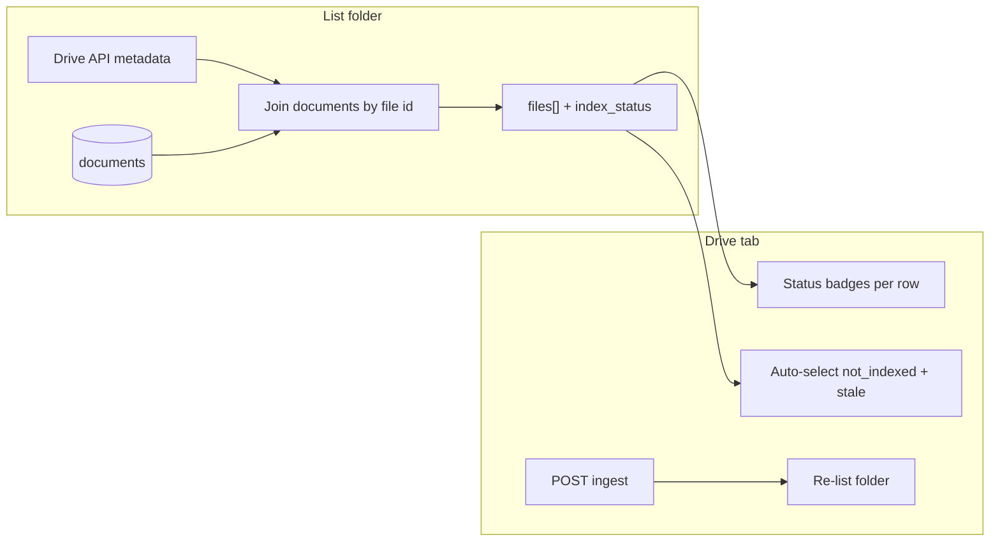

# Drive folder ingest status

## Problem

Users cannot tell which Google Docs in a folder are already in the shared index. The **Documents** tab answers “what’s ingested globally,” but the **Drive** tab lists folder files with no cross-reference. Manual Drive folders (`to_be_ingested` / `successfully_ingested`) are unnecessary if the app shows status inline.

## Approach

Enrich [`GET /drive/files`](app/main.py) server-side: for each listed Drive file ID, look up matching rows in `documents` and compute status. Return status on each file so the Drive tab needs one request (not a full `GET /documents` join on the client).



## Status rules

Drive file `id` maps 1:1 to `documents.doc_id` for Google Drive ingests ([`app/drive_client.py`](app/drive_client.py)).

| Condition | `index_status` |
|-----------|----------------|
| No row in `documents` | `not_indexed` |
| Row exists, and Drive `modifiedTime` ≤ `source_modified_at` (or either timestamp missing) | `indexed` |
| Row exists, and Drive `modifiedTime` > `source_modified_at` | `stale` |

Reuse existing parser [`_drive_modified_to_unix`](app/drive_client.py) for RFC3339 → Unix seconds. Extract a small pure helper (e.g. `compute_index_status(in_db, drive_modified_unix, source_modified_at) -> str`) so logic is testable without mocking Drive/DB.

## Backend changes

### 1. Models — [`app/models.py`](app/models.py)

Extend `DriveFileMeta`:

```python
index_status: Literal["not_indexed", "indexed", "stale"] = "not_indexed"
num_chunks: int | None = None  # set when indexed or stale
```

Extend `DriveFileListResponse` with optional summary counts (keeps UI simple):

```python
summary: DriveFileListSummary  # total, indexed, not_indexed, stale
```

### 2. DB helper — [`app/db.py`](app/db.py)

Add targeted lookup (avoid loading all documents):

```python
def get_document_index_by_doc_ids(conn, doc_ids: list[str]) -> dict[str, tuple[int | None, int]]:
    # doc_id -> (source_modified_at, num_chunks)
```

Use `WHERE doc_id = ANY(%s)` with empty-list guard.

### 3. Endpoint — [`app/main.py`](app/main.py)

In `drive_files`:

1. Call existing `list_docs_metadata(...)` (already returns `modifiedTime`).
2. Collect file IDs; call `get_document_index_by_doc_ids`.
3. For each file, compute `index_status` and attach `num_chunks` when in DB.
4. Build and return `summary` counts.

Wire through existing `with_db_conn_retry` / sync DB pattern used by other endpoints in this handler’s neighborhood.

### 4. Tests — new `tests/test_drive_index_status.py`

Unit-test `compute_index_status` cases:

- not in DB → `not_indexed`
- in DB, drive time older/equal → `indexed`
- in DB, drive time newer → `stale`
- missing timestamps → `indexed` (conservative default)

No live Drive/Postgres integration test required for v1.

## Frontend changes

### 1. Types — [`frontend/src/types/index.ts`](frontend/src/types/index.ts)

Mirror backend: `index_status`, `num_chunks?`, and `DriveFileListSummary` on `DriveFileListResponse`.

### 2. Drive tab — [`frontend/src/components/drive/DriveTab.tsx`](frontend/src/components/drive/DriveTab.tsx)

**List success handler:**

- Store files + summary from response.
- **Auto-select** all files where `index_status !== 'indexed'` (not_indexed + stale), per your preference.
- Update banner: e.g. `Found 12 docs — 7 indexed, 3 not indexed, 2 stale`.

**File rows:**

- Status badge column (text + color, no emoji required):
  - **Not indexed** — neutral/muted
  - **Indexed** — green; show chunk count if present
  - **Stale** — amber/warning; tooltip or subtext: “Drive doc changed since last ingest”
- Optionally dim or disable checkbox styling for `indexed` rows (still allow manual select for forced re-ingest via skip path).

**After ingest:**

- On `ingestMutation.onSuccess`, re-run list (same folder ID) to refresh statuses and recompute selection.
- Invalidate `['documents']` query (via `useQueryClient`) so Documents tab stays in sync.

### 3. No new API client methods

[`frontend/src/api/drive.ts`](frontend/src/api/drive.ts) unchanged — response shape grows; existing `driveListFiles` picks up new fields automatically.

## Out of scope (deliberate)

- **Auto-move files in Drive** — stays read-only; no write scope.
- **Re-ingest stale docs automatically** — user selects stale rows and clicks Ingest (existing skip/duplicate behavior applies unless you later add a “force re-sync from Drive” path).
- **PDF uploads** — not listed in Drive; Documents tab remains source of truth for those.
- **Filter/sort controls** — can add later if folder lists get large; summary + badges are enough for v1.

## Manual test plan

1. Pick a Drive folder with mix of: never-ingested docs, already-ingested docs, and an ingested doc you edit in Drive.
2. **List Docs** — verify badges and summary counts; confirm not_indexed + stale are pre-selected, indexed are not.
3. **Ingest** selection — confirm new docs ingest, already-indexed are skipped; list refreshes to updated counts.
4. Edit an indexed doc in Drive, re-list — row should flip to **Stale**.
5. Open **Documents** tab after ingest — new titles appear without manual refresh.
