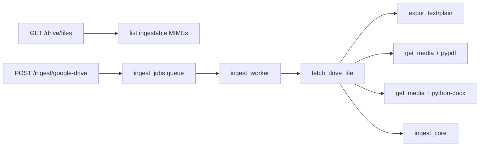

# Drive ingest: PDFs and Word (.docx)

## Problem

The team inbox ([`app/drive_client.py`](app/drive_client.py)) only queries `application/vnd.google-apps.document`. Your **Ready for AI Ingest** folder holds **PDFs**, so list/ingest correctly returns zero today. PDF upload via **Documents** (`POST /ingest/file`) already works; this change wires the **same extraction** through Drive.

## Target behavior

**Supported MIME types (v2 allowlist):**

| Type | MIME | Fetch method |
|------|------|----------------|
| Google Doc | `application/vnd.google-apps.document` | `export_media` → `text/plain` (unchanged) |
| PDF | `application/pdf` | `get_media` → [`extract_text_from_pdf`](app/pdf_extract.py) |
| Word | `application/vnd.openxmlformats-officedocument.wordprocessingml.document` | `get_media` → new `extract_text_from_docx` |

Legacy `.doc` (`application/msword`) is **out of scope** per your choice.

## Backend changes

### 1. Allowlist and Drive query ([`app/drive_client.py`](app/drive_client.py))

- Add `DRIVE_INGEST_MIMES` tuple and `drive_mime_query_clause()` building  
  `(mimeType = '…' or mimeType = '…')` for folder listing.
- Update `list_docs_metadata` (keep name; broaden docstrings) to accept any allowlisted MIME for both `file_ids` and folder `files().list` queries.
- Add `MAX_DRIVE_DOWNLOAD_BYTES = 50 * 1024 * 1024` (same as [`MAX_UPLOAD_PDF_BYTES`](app/main.py)) and reject oversized downloads before extraction.
- Replace `export_drive_doc` with **`fetch_drive_file(file_id) -> DriveDoc`**:
  - Load metadata (`id`, `name`, `mimeType`, `modifiedTime`).
  - Branch on `mimeType`: export vs `get_media().execute()`.
  - Run appropriate extractor; raise `DriveClientError` on empty/unsupported MIME (clear message for scanned PDFs).
- Add **`drive_file_view_url(file_id)`** → `https://drive.google.com/file/d/{id}/view` and **`drive_google_doc_url(file_id)`** (existing gdoc link) for ingest worker `source_url`.

### 2. DOCX extraction (new [`app/docx_extract.py`](app/docx_extract.py))

- Add dependency **`python-docx`** in [`requirements.txt`](requirements.txt).
- `extract_text_from_docx(data: bytes) -> str`: `BytesIO` + `Document`, join paragraph text; `ValueError` if empty/too small (mirror PDF module style).
- Unit tests in `tests/test_docx_extract.py` with a minimal in-memory docx fixture (zip/XML), no Drive API.

### 3. Ingest worker ([`app/ingest_worker.py`](app/ingest_worker.py))

- Call `fetch_drive_file` instead of `export_drive_doc`.
- Set `source_url` from MIME: gdoc → Docs edit URL; PDF/docx → Drive file view URL.
- Keep `doc_id` = Drive file id (idempotency unchanged).

### 4. API messages ([`app/main.py`](app/main.py))

- Update docstrings on `GET /drive/files` and `POST /ingest/google-drive`.
- Change 400 detail from `"No Google Docs found to ingest"` → `"No ingestable files found in Drive"` (or similar).

### 5. Source URL fallback ([`app/source_url.py`](app/source_url.py))

- For legacy `google_drive` rows **without** stored `source_url`, default to **Drive file view** (`drive_file_view_url`) instead of assuming every id is a Google Doc. New ingests will store the correct URL explicitly.

### 6. Models ([`app/models.py`](app/models.py))

- Relax field descriptions: “Google Doc” → “ingestable Drive file” on `DriveFileMeta`, `DriveFileListSummary`, `DriveFileListResponse` (API shape unchanged).

## Frontend ([`frontend/src/components/drive/DriveTab.tsx`](frontend/src/components/drive/DriveTab.tsx))

- Copy: “Google Doc(s)” → “file(s)” or “ingestable file(s)”; button **List Docs** → **List files**.
- Help text: note supported types (Google Docs, PDF, Word .docx).
- Optional small type hint in file row from `mimeType` (e.g. `PDF`, `DOCX`, `GDoc`) — low effort, helps operators.

No API contract changes beyond broader listing; existing `driveListFiles` / ingest calls stay the same.

## Tests and scripts

| Area | Action |
|------|--------|
| `tests/test_docx_extract.py` | Happy path + empty docx errors |
| `tests/test_drive_ingest_mimes.py` | Query clause + `is_drive_ingestable_mime` helpers |
| [`tests/test_drive_index_status.py`](tests/test_drive_index_status.py) | Unchanged (status logic still valid) |
| [`scripts/test_drive_connection.py`](scripts/test_drive_connection.py) | Print MIME + count “ingestable files” |
| Worker | Optional: mock `fetch_drive_file` in one test if easy; otherwise rely on extract unit tests |

## Docs

- [`setup_and_testing.md`](setup_and_testing.md) / README Drive section: inbox supports **Google Docs, PDF, .docx**; 50 MB download cap; image-only PDFs still fail (same as upload).

## Out of scope (follow-ups)

- Legacy `.doc` (`application/msword`)
- `POST /ingest/file` accepting `.docx` upload (separate from Drive; can mirror later)
- Google Sheets / Slides
- OCR for scanned PDFs

## Verification (manual)

1. Set folder to **Ready for AI Ingest** (`1HUgl4ryKyijBOP4_nJkJCCT3mvLdKPih`).
2. **Test credentials** → OK.
3. **List files** → 3 PDFs appear with `not_indexed`.
4. **Ingest** → batch succeeds; Documents tab shows 3 rows with Drive view links.
5. Re-list → `indexed`; re-ingest without Drive change → `skipped`.
