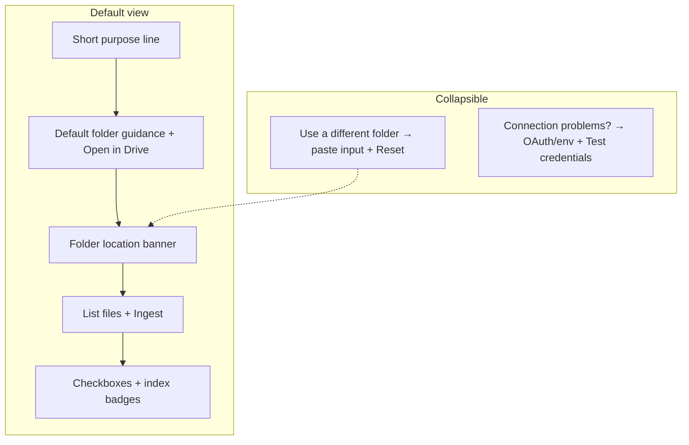

# Drive tab user-friendly UX

## Context

Your screenshot shows the older UI (`Optional folder ID`, `List Docs`). The working tree already has a richer [`DriveTab.tsx`](frontend/src/components/drive/DriveTab.tsx): team inbox from `GET /config`, location banner, index badges, and `List files` / `Ingest`. This plan **refines that screen** for operators, not replumbing the backend.

Default folder ID in env matches your link: `1HUgl4ryKyijBOP4_nJkJCCT3mvLdKPih` ([`.env.example`](.env.example)). The UI should build the URL with existing [`driveFolderUrl(teamInboxId)`](frontend/src/lib/driveFolder.ts) so deploys stay config-driven—no hardcoded URL in source.



## Target layout ([`DriveTab.tsx`](frontend/src/components/drive/DriveTab.tsx))

### 1. Remove always-visible auth block

**Delete** the top paragraph that names `GOOGLE_REFRESH_TOKEN`, `/auth/google`, and `GOOGLE_REDIRECT_URI` (lines 253–269 today).

**Replace** with a native `<details>` section (no new dependencies; matches “button if having trouble”):

- **Summary:** `Connection or setup problems?`
- **Body (admin/deployer audience):**
  - Same factual steps as today: server credentials, open `{apiOrigin}/auth/google`, match redirect URI, paste refresh token into env.
  - Move **supported types** (Google Docs, PDF, DOCX) and **50 MB limit** here—operators care; everyday users do not.
  - Keep **Test credentials** inside this panel (not above the fold).

Optional polish: when `testMutation` or `listMutation` fails with a message containing `credentials` / `token`, auto-expand this section (local `useState` + `useEffect` on `err`).

### 2. Default-folder guidance (replaces prominent folder input)

**When** `publicConfig.google_drive_default_folder_id` is set:

Show user-facing copy (tune wording in implementation; substance from your request):

> Our default folder for ingesting completed reports into the repository is **[link]**. You may change selections and ingest from other folders below, but the best procedure is to copy your file into that folder first.

- **Link `href`:** `driveFolderUrl(teamInboxId)`
- **Link text:** prefer `google_drive_default_folder_label` when set (e.g. “Ready for AI Ingest”); otherwise “Open team ingest folder in Google Drive” (avoid raw folder IDs in prose).
- Add a secondary inline action: **Open in Drive** (same URL) near the location banner if not redundant.

**When** default folder is **not** configured: show a short amber-style note that an admin must set `GOOGLE_DRIVE_DEFAULT_FOLDER_ID`, and show the folder paste control **expanded** (no collapse)—override is required for the tab to work.

### 3. Collapse folder override (your choice)

Wrap the existing **Inbox folder** input, parse error, and **Reset to team inbox** in:

- `<details>` summary: **`Use a different folder`**
- Default: **closed** when team inbox is configured; **open** when not configured.

Behavior unchanged: `folderInput`, `commitFolderInput`, `localStorage`, `resolveDriveFolderForApi`, auto-list on init, location banner, `driveGetFolder` query.

### 4. Keep and lightly reorder existing working pieces

| Element | Change |
|--------|--------|
| Location banner (`Folder: … · Team inbox / Custom`) | Keep; sits under default copy, above actions |
| `List files` / `Ingest` | Keep labels; remain primary actions |
| Warning when no folder + no selection | Shorten copy to match new flow (“Select files or open *Use a different folder*”) |
| File list + index badges | No change |

### 5. No backend changes

`GET /config` already exposes `google_drive_default_folder_id` and `google_drive_default_folder_label`. Folder resolution and ingest APIs stay as-is.

### 6. Docs (optional, one line)

In [`setup.md`](setup.md) Drive section: note that the tab hides OAuth/env instructions under **Connection or setup problems?** for end users.

## Copy reference (implementation)

```tsx
// Pseudocode — when teamInboxId is set
<p>
  Our default folder for ingesting completed reports into the repository is{' '}
  <a href={driveFolderUrl(teamInboxId)} target="_blank" rel="noopener noreferrer">
    {teamInboxLabel || 'the team ingest folder'}
  </a>
  . You may change selections and ingest from other folders below, but the best
  procedure is to copy your file into that folder first.
</p>
```

## Manual verification

1. With `GOOGLE_DRIVE_DEFAULT_FOLDER_ID` + label set → tab opens with guidance + link only; override and auth panels collapsed.
2. Expand **Use a different folder** → paste URL → banner shows custom path; **Reset to team inbox** works.
3. Expand **Connection or setup problems?** → see OAuth steps; **Test credentials** succeeds/fails as today.
4. Unset default folder id → override section open; guidance explains admin setup.
5. Refresh frontend build if UI still shows old “Optional folder ID” (stale bundle).

## Out of scope

- Per-user Drive OAuth in the browser (still server refresh token).
- Changing default folder ID in UI (still env/config).
- New env var for a custom marketing URL (ID → URL is enough).
