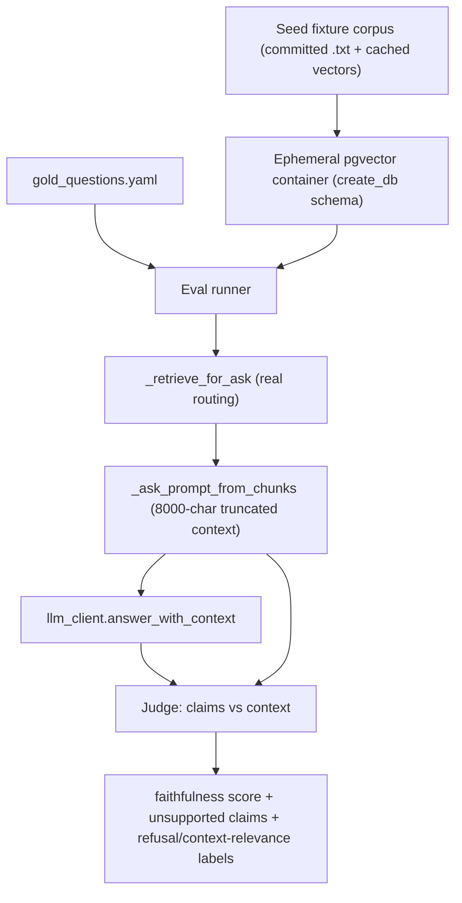

## Faithfulness eval harness (verbiage / basic-QA mode)

Scope: purpose #1 only -- retrieve relevant chunks + answer basic questions. The question we are answering after every tweak: *is every claim in `answer` supported by the retrieved context that was actually put in the prompt?* Out of scope: draft generation, image input, frontend.

### Why a separate, freshly-seeded test DB
Tweaks include retrieval changes (chunking, RRF, `auto` routing), so the corpus must be frozen to attribute score deltas to the change and not corpus drift. The current integration test runs against the live `DATABASE_URL` ([tests/test_retrieval_integration.py](tests/test_retrieval_integration.py) lines 29-32), which is not reproducible. We seed a small fixed corpus into a throwaway pgvector container each run.

### Data flow

### 1. Ephemeral test DB
- New `docker-compose.eval.yml` (or testcontainers) running `pgvector/pgvector:pg15` (same image as [docker-compose.yml](docker-compose.yml) line 6) on a non-default port, no persistent volume.
- A pytest fixture connects, calls `create_db(conn)` ([app/db.py](app/db.py) line 67 -- creates tables, `content_tsv` generated column, GIN index), seeds, and yields the conn. Schema must come from `create_db`, not hand-rolled, so lexical/vector both work.

### 2. Frozen corpus + gold questions
- `tests/eval/corpus/` -- 3-5 small redacted report texts (include storm-damage language so the water-damage question is answerable). Stored as canonical `full_text` so reseeding is trivial.
- `tests/eval/embeddings_cache.json` -- cached vectors keyed by (model, chunk text) so seeding is deterministic and offline. Decision: seed once with the real `HttpEmbedder`, commit the cache; reseed reads the cache and only calls the embedder on a miss.
- `tests/eval/gold_questions.yaml` -- each entry: `question`, `category` (answerable_single / answerable_multi / unanswerable), and optional `must_mention` substrings. Include the real "water damage due to storm created opening" query and at least one deliberately unanswerable question.

### 3. Seeding helper
- `tests/eval/seed.py`: for each corpus doc -> `insert_document` ([app/db.py](app/db.py) line 273) then `index_document` ([app/indexing.py](app/indexing.py) line 24) with an embedder shim that reads `embeddings_cache.json`. This reuses the exact chunk/embed/store path the app uses.

### 4. Eval runner (reuse real pipeline, do not re-implement)
For each gold question:
- embed -> `_retrieve_for_ask(conn, AskRequest(...), vec, model, "eval")` ([app/main.py](app/main.py) line 788) so real `auto` routing/RRF is exercised.
- build context with `_ask_prompt_from_chunks` ([app/main.py](app/main.py) lines 760-785) -- critical: judge against this truncated/joined context, not raw `top_chunks`, to avoid false passes from chunks truncated out at `MAX_CONTEXT_CHARS = 8000`.
- generate via `llm_client.answer_with_context(prompt)` ([app/llm_client.py](app/llm_client.py) line 146).
- detect the `prompt is None` / "I don't have relevant context" refusal path and label it; on `unanswerable` questions a refusal is a PASS and is excluded from the faithfulness denominator.

### 5. Judges (two tiers, per your choice)
`tests/eval/judges.py`:
- Claim decomposition: split `answer` into atomic claims (sentence-level to start).
- Fast gate (every tweak): local NLI cross-encoder via `sentence-transformers` (already a dep, used by [app/reranker.py](app/reranker.py)) -- use an NLI model (e.g. `cross-encoder/nli-deberta-v3-base`), score each claim's entailment vs the context, flag below threshold. Free, deterministic.
- Deep judge (nightly/manual): OpenAI LLM-as-judge returning `{claim, supported, evidence}` JSON; faithfulness = supported/total.
- Report: per-question faithfulness, list of unsupported claims, plus a context-relevance signal (did retrieval even return the `must_mention` terms) so a low score points at generator vs retriever.

### 6. Wiring + ergonomics
- pytest markers: `eval_fast` (NLI, intended to run after every tweak) and `eval_full` (LLM judge). Gate behind an env flag like the existing `VERBIAGE_INTEGRATION` pattern so normal `pytest` stays fast and offline.
- A `make eval` / documented command that brings up the container, runs `eval_fast`, prints a scoreboard, tears down.
- Assertion bar: `eval_fast` asserts no unsupported claims on `answerable_*` questions and correct refusal on `unanswerable`; print scores even on pass for trend visibility.

### Open decision (can default)
- Embedding backend for seeding: default to cached-vectors fixture (deterministic, offline). If you would rather always call the live embedder at seed time, drop the cache step.
