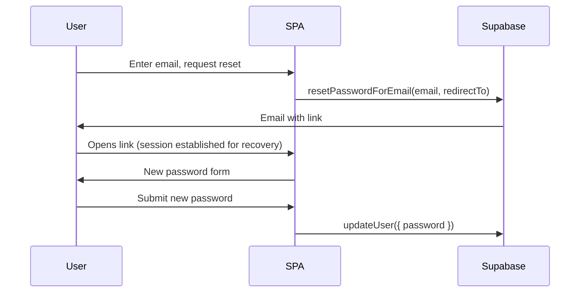

# Forgot password (Supabase-native)

## Why this approach

You already use **Supabase Auth** with `signInWithPassword` and a Python **`POST /auth/signup`** path ([`frontend/src/context/AuthContext.tsx`](frontend/src/context/AuthContext.tsx), [`app/main.py`](app/main.py)). The smoothest option is **not** a custom token store or bespoke email—use [Supabase password reset](https://supabase.com/docs/guides/auth/auth-password-reset): one email, one redirect back to the app, `updateUser({ password })` on the client.

## Implementation (concrete)

### 1. Public redirect origin (recommended for production)

Add an optional server env, e.g. **`PUBLIC_APP_URL`** (or `APP_ORIGIN`), exposed in [`GET /config`](app/main.py) as something like `public_app_url`, alongside existing fields. Extend [`PublicAppConfig`](frontend/src/context/AuthContext.tsx) to include it.

- **Use** it to build `redirectTo` for `resetPasswordForEmail` (e.g. `new URL('/', public_app_url).href` or trimmed string + `/`).
- **Fallback** when unset: `window.location.origin + '/'` so local dev keeps working.

This avoids reset links pointing at the wrong host when the API and browser URL differ.

### 2. Auth context: send reset + complete reset

In [`AuthContext.tsx`](frontend/src/context/AuthContext.tsx):

- Add **`requestPasswordReset(email: string)`** → `supabase.auth.resetPasswordForEmail(email, { redirectTo })`.
- Add **`completePasswordReset(newPassword: string)`** → `supabase.auth.updateUser({ password: newPassword })` (throw on error like `signIn`).
- Expose **`passwordRecovery`** (boolean): `true` when the user must set a new password before treating them as “done.”

### 3. Fix listener order (important for a “nice” UX)

There are real-world reports of missing `PASSWORD_RECOVERY` when `getSession()` runs before `onAuthStateChange` is registered ([auth-js discussion](https://github.com/supabase/auth-js/issues/349)).

When creating the client in the bootstrap `useEffect`, **subscribe to `onAuthStateChange` before awaiting `getSession()`**, in the same function. Set session state from both the callback and the initial `getSession()` result.

**Fallback:** on the very first callback or initial session, if `PASSWORD_RECOVERY` is unreliable in your environment, treat **“has session + URL hash/query indicates recovery”** as recovery mode. Many links include `type=recovery` in the hash before the client consumes it—you can read `window.location.hash` once synchronously when the app loads (optional extra guard).

### 4. UI: [`LoginPanel.tsx`](frontend/src/components/auth/LoginPanel.tsx)

- On **Sign in** tab: add **“Forgot password?”** → switches to a small **email-only** step; submit calls `requestPasswordReset`; show a **neutral success message** (“If an account exists, we sent a link”) to reduce email enumeration concerns.
- When **`passwordRecovery`** is true (and Supabase session exists): show **New password** + **Confirm password** (client-side match), then `completePasswordReset`, then clear recovery state (user stays signed in with the new password per Supabase behavior).

### 5. Gate the main app during recovery

Today [`AppInner`](frontend/src/App.tsx) treats any `session` as fully logged in and shows tabs. After a reset link, the user may have a session **before** choosing a new password.

**Change:** if `passwordRecovery`, render a focused full-width (or same centered layout) **reset form** instead of `ChatTab` / `DocumentsTab`, even when `session` is non-null. After successful `updateUser`, `passwordRecovery` becomes false and the normal shell appears.

## Supabase Dashboard (required manual step)

In **Authentication → URL Configuration**:

- Add **Redirect URLs** for every environment the app uses, e.g. `http://localhost:5173/**`, `https://your-production-host/**` (wildcard as allowed by Supabase).

Without this, the link in the email will fail to redirect correctly.

## Out of scope / alternatives

- **Magic link / OTP-only** flows would replace password reset UX entirely; not needed if you keep email+password.
- **PKCE + server `/auth/confirm`** is valuable for SSR/cookies; you’re on a browser SPA with anon key—implicit/hash handling via the JS client is the lighter fit unless you later adopt SSR auth.
