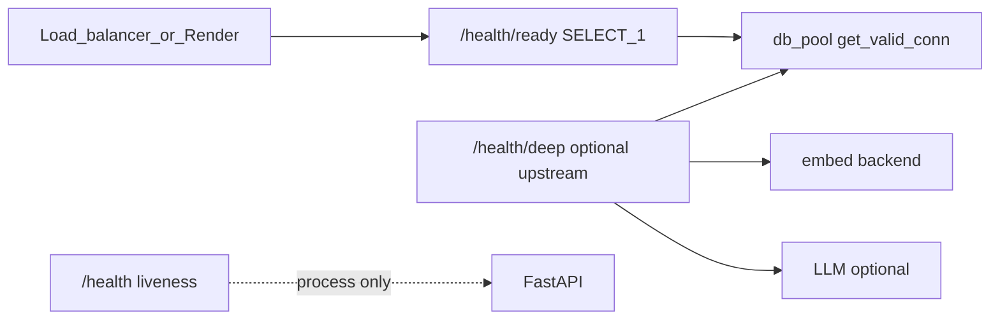

# Health checks that reflect reality

## Problem

[`GET /health`](app/main.py) always returns `{"healthy": true}` even when the DB pool is broken or Supabase is paused. Render/load balancers using that path will keep sending traffic to a process that cannot serve RAG routes.

```885:887:app/main.py
@app.get("/health")
def health():
    return {"healthy": True}
```

The app already validates DB connections at startup and on each request via [`get_valid_conn`](app/db.py) (`SELECT 1` + one retry). Readiness should expose that same signal on a dedicated route.

## Target semantics (Kubernetes-style)

| Route | Purpose | When to use |
|-------|---------|-------------|
| `GET /health` | **Liveness** — Uvicorn/process is up | Container restart only; keep current JSON for backward compatibility |
| `GET /health/ready` | **Readiness** — can serve requests that need Postgres | **Render health check path**, ALB target group, `docker-compose` app `healthcheck` |
| `GET /health/deep` | **Optional dependency probe** — DB + embed (+ LLM if enabled) | Manual ops, synthetic monitoring, **not** high-frequency LB probes |



## Implementation

### 1. New module [`app/health.py`](app/health.py)

Keep [`main.py`](app/main.py) thin; centralize check logic here.

**Database (ready + deep)**

- Accept `request: Request`, read `request.app.state.db_pool`.
- Call existing `get_valid_conn(pool)` (already runs `SELECT 1`), run the user callback (no-op), `putconn(conn)` in `finally`.
- On success: `(True, "ok")`; on `psycopg2.Error` / missing pool: `(False, short message)` — no retries beyond what `get_valid_conn` already does.

**Embed (deep only)**

- New `async def check_embed_backend() -> tuple[bool, str]` with a **dedicated short timeout** (env `HEALTH_DEEP_TIMEOUT`, default **5** seconds), **no** retry loop (unlike [`embed_texts`](app/embeddings_client.py)).
- Branch on the same rules as [`HttpEmbedder`](app/embeddings.py):
  - **OpenAI path** (`OPENAI_API_KEY` and not `EMBED_LOCAL_ONLY`): `POST https://api.openai.com/v1/embeddings` with `input: ["x"]`, `dimensions: 768`, `model: text-embedding-3-small` — minimal but real; acceptable because `/health/deep` is not polled every few seconds.
  - **Ollama path**: `POST {EMBED_BASE_URL}/api/embed` with `input: ["x"]` and `EMBED_MODEL`.
- Treat 429 as unhealthy (surface in JSON); do not increment production retry metrics from health (or call embed helpers directly via httpx to avoid coupling).

**LLM (deep only, opt-in)**

- Env `HEALTH_DEEP_CHECK_LLM` (default off) so deep checks do not surprise OpenAI-only deploys.
- When enabled:
  - **OpenAI** (`OPENAI_API_KEY`): lightweight `GET https://api.openai.com/v1/models` (auth only, no completion tokens).
  - **Ollama**: `GET {LLM_BASE_URL}/api/tags` (or root) with same short timeout.
- When disabled: report `"llm": "skipped"` in checks.

**Aggregate helpers**

- `build_ready_response(request) -> JSONResponse`: 200 if DB ok, **503** if not; body e.g. `{"ready": true, "checks": {"database": "ok"}}`.
- `build_deep_response(request) -> JSONResponse`: 200 only if **all** exercised checks pass; 503 otherwise.

### 2. Wire routes in [`app/main.py`](app/main.py)

Replace the single stub with three handlers (still **no auth** — same as today; auth is per-route `Depends`, not global).

```python
@app.get("/health")
def health():
    return {"healthy": True}

@app.get("/health/ready")
def health_ready(request: Request):
    return build_ready_response(request)

@app.get("/health/deep")
async def health_deep(request: Request):
    return await build_deep_response(request)
```

### 3. Config in [`app/config.py`](app/config.py)

```python
HEALTH_DEEP_TIMEOUT = int(os.getenv("HEALTH_DEEP_TIMEOUT", "5"))
HEALTH_DEEP_CHECK_LLM = os.getenv("HEALTH_DEEP_CHECK_LLM", "").lower() in ("1", "true", "yes")
```

Document in [`.env.example`](.env.example) under a short “Health checks” comment block.

### 4. Ops / docs updates

- **[`setup.md`](setup.md)** / **[`setup_and_testing.md`](setup_and_testing.md)**: document `curl /health/ready` (expect 503 when DB down); note Render should set **Health Check Path** to `/health/ready`, not `/health`.
- **[`frontend/vite.config.ts`](frontend/vite.config.ts)**: extend dev proxy regex to include `health(?:/ready|/deep)?` so local SPA dev can hit new paths.
- **[`docker-compose.yml`](docker-compose.yml)** (optional but recommended): add `app` service `healthcheck` calling `/health/ready` via `curl -f` (may need `curl` in image or use Python one-liner; slim image currently has no curl — use `wget`/`python -c` or add minimal healthcheck script).

### 5. Tests — [`tests/test_health.py`](tests/test_health.py)

- **`/health`**: always 200 with `healthy: true` (no DB).
- **`/health/ready`**: mock `app.state.db_pool` and patch `get_valid_conn` to succeed vs raise → 200 vs 503.
- **`/health/deep`**: mock DB + `httpx` (or patch check functions) so embed failure yields 503 with structured `checks`.

Avoid requiring a live Postgres/OpenAI in CI (same pattern as [`tests/test_metrics.py`](tests/test_metrics.py)).

## Render / load balancer guidance (for you after merge)

1. In Render service settings, set **Health Check Path** to `/health/ready`.
2. Keep liveness/restart policy on `/health` if you use a separate probe, or rely on Render’s process monitoring.
3. Do **not** point Render at `/health/deep` unless you explicitly want periodic OpenAI embedding calls.

## Out of scope (unless you want them later)

- **Supabase Auth** JWT validation on ready — not required for “can we query pgvector”; auth failures are per-request, not “remove from LB.”
- **Prometheus metrics** for health failures — can add counters later if useful.
- Changing existing `/health` response shape (preserves [`setup.md`](setup.md) curl example).

## Files to touch

| File | Change |
|------|--------|
| [`app/health.py`](app/health.py) | New — DB / embed / LLM check helpers + response builders |
| [`app/main.py`](app/main.py) | Register `/health/ready`, `/health/deep` |
| [`app/config.py`](app/config.py) | `HEALTH_DEEP_*` env vars |
| [`.env.example`](.env.example) | Document health env + Render path |
| [`tests/test_health.py`](tests/test_health.py) | Unit tests with mocks |
| [`setup.md`](setup.md), [`setup_and_testing.md`](setup_and_testing.md), [`frontend/vite.config.ts`](frontend/vite.config.ts) | Docs + dev proxy |
| [`docker-compose.yml`](docker-compose.yml) | Optional app `healthcheck` on `/health/ready` |
