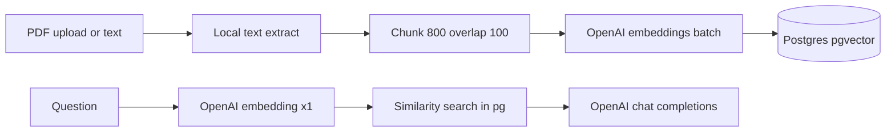

# Production cost estimate (Verbiage / current stack)

Reference your implementation so pricing matches what actually runs:

- **Ingest:** Local PDF→text extraction, then `[app/chunking.py](app/chunking.py)` (default **800** chars chunk, **100** overlap → step **700** chars), then one embedding vector per chunk via [`HttpEmbedder` → OpenAI when `OPENAI_API_KEY` and not `EMBED_LOCAL_ONLY`](app/embeddings.py). Model: [`text-embedding-3-small` @ 768 dimensions](app/embeddings_openai.py).
- **Ask:** [`POST /ask`](app/main.py): **1 embedding call** on the question, retrieve `top_k` (default **5**) chunks, build context capped at **`MAX_CONTEXT_CHARS = 8000`**, single user message to OpenAI Chat Completions when key set ([`LLM_OPENAI_MODEL` defaults to **`gpt-4o-mini`**](app/config.py), [`_answer_openai`](app/llm_client.py) — note `max_tokens` is **not** set; output length follows API defaults unless you change the client).

**OpenAI list prices used (standard tier)** from [platform pricing docs](https://platform.openai.com/docs/pricing): **`text-embedding-3-small` = $0.02 / 1M input tokens**; **`gpt-4o-mini` = $0.15 / 1M input**, **$0.60 / 1M output**.

**Not included:** Render, Supabase quotas, Postgres storage/IO, Google Drive quotas — those depend on plan and data size.

---

### Assumptions and methodology

**Chunk/token math (ingest)**

- Characters extracted per PDF vary more than page count (layout, bullets, scanned vs text PDF). Use **chars per document** \(L\) as the driver.
- Number of chunks ≈ **`ceil(L / 700)`** once \(L\) is noticeably larger than 800 (from `chunk_text_chars`).
- Embedding is billed over **every chunk body** separately; overlap duplicates text, so total embedded tokens are **somewhat above** \(L\) in tokenizer space — a workable bracket is multiply “unique doc tokens” by **~`800/700` ≈ 1.14×** vs a naive \(L\) token estimate.
- Rough **English tokenizer heuristic:** **~4 characters per token** (order-of-magnitude; real counts depend on wording).

Example mid case: \(L ≈ 30 × 2000\) = **60k chars/doc** ↔ ~**15k** unique tokens → ~**17k embedding tokens billed/doc** × 1000 docs ≈ **17M tokens** × $0.02/M ≈ **$0.34** one-time.

**Sensitivity (1,000 PDFs, one-time embed)** — embedding only:

| Scenario | Rough \(L\) / doc | Order of magnitude (embedding $ @ $0.02/M) |
|----------|-------------------|-------------------------------------------|
| Light text | ~15k chars (~500 chars/pg) | ~4–5M total tokens → **~$0.08–0.10** |
| Mid | ~60k chars | ~17M tokens → **~$0.30–0.40** |
| Heavy/dense | ~120k chars | ~35M tokens → **~$0.60–0.80** |

**Caveats that can blow this up**

- **`EMBED_LOCAL_ONLY=1`** or no `OPENAI_API_KEY`: OpenAI ingest embedding cost → **~$0** (Ollama costs = your hardware/electricity only).
- **Rescrapes / re-ingest**: you pay embeddings again whenever chunk text is re-sent.
- **Image-only PDFs**: current pipeline is text extraction (`extract_text_from_pdf`); OCR or vendor APIs would add a **different** cost line item not modeled here.

---

### 5 questions/day × 365 days (~1,825 `/ask` calls)

Per ask (OpenAI path, defaults):

| Step | What runs | Typical token scale |
|------|-----------|---------------------|
| Query embed | [`embed_many([question])`](app/main.py) | ~20–120 tokens (**negligible** $ at $0.02/M) |
| Chat completion | Prompt ≈ instructions + **up to 8k chars** context (~2k tokens) + question | Input often **~2.0–2.8k tokens** depending on truncation |
| Completion | `_answer_openai` has no explicit `max_tokens` | Outputs often **~200–600 tokens** unless answers are very long |

**Illustrative annual math** (gpt-4o-mini, **standard** tier):

- **Input:** 1,825 × **2.5k** tokens ≈ **4.6M** × $0.15/M → **~$0.69**
- **Output:** 1,825 × **400** tokens ≈ **0.73M** × $0.60/M → **~$0.44**

**Rough total**: **~$1.1/year** LLM-only at that profile; rounding up for heavier answers or fuller context (**3k input**, **700 output**) still tends to stay under **~$2–4/year** for this volume unless you lengthen context, raise `top_k`/limits, change model (`LLM_OPENAI_MODEL`), or add tools.

Embedding for queries stays **fractions of a dollar** at this volume.

---

### Flow sketch (billing touchpoints)

---

### Bottom line for “moving to production”

- With **`OPENAI_API_KEY`** and default models: **embedding the corpus once is inexpensive** at this scale (~**sub-dollar to low single-digit dollars** bracket under normal text densities); **`/ask` at 5/day is usually single-digit dollars per year** in API tokens at `gpt-4o-mini`-class pricing.
- **Define “production bill” separately for:** OpenAI (~above) vs **Render + managed Postgres + Supabase** (~plan-dependent constants you should tally from dashboards).
