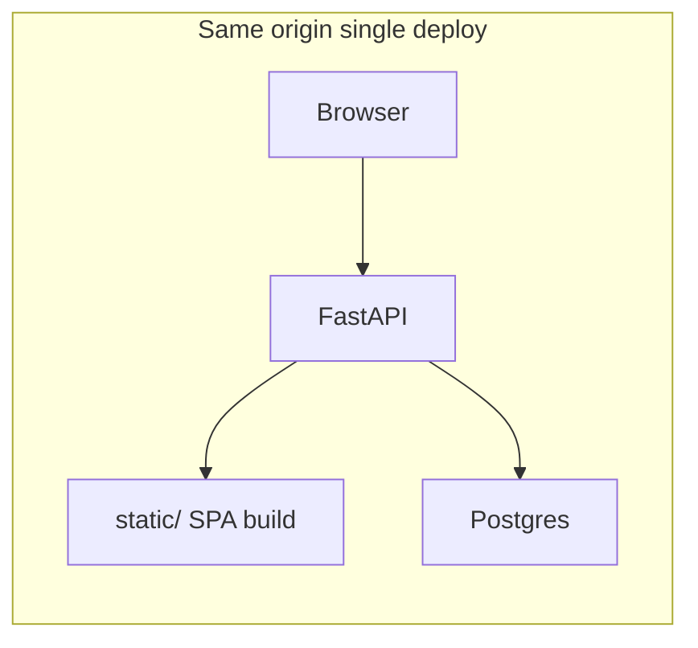
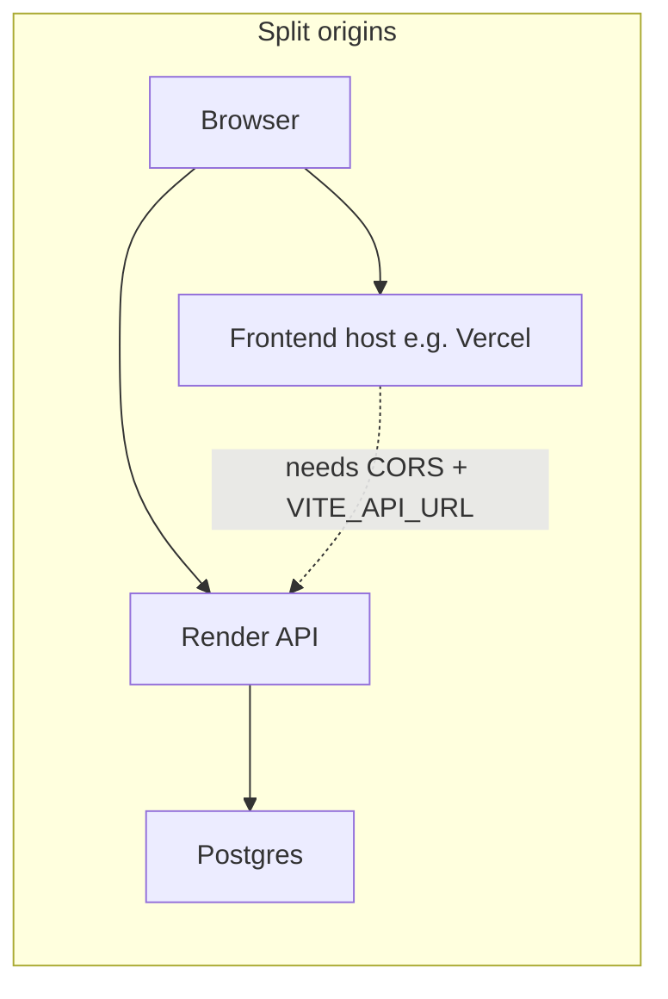

# Production frontend plan (non-Streamlit)

## Current state

- **No Streamlit** in this repo. The deployed “web UI” is a large vanilla app in [`static/index.html`](static/static/index.html), mounted last in FastAPI ([`app/main.py`](app/main.py) ~L835–838) after API routes — same-origin only.
- **No existing frontend roadmap** under [`.cursor/plans/`](.cursor/plans/); unrelated plans cover API costs, signup gating, and citations.
- **Prototype to leverage:** [`files_for_reference/frontend/`](files_for_reference/frontend/) — React 19 + Vite + TypeScript + `@tanstack/react-query`, tabs: Chat, Documents, Drive, Vision ([`files_for_reference/frontend/src/App.tsx`](files_for_reference/frontend/src/App.tsx)).

## Backend/API reality (prototype mismatch)

Align the UI contract with [`app/main.py`](app/main.py) instead of copying the prototype’s `/api/*` shapes blindly:

| Area | Prototype expects | Verbiage today |
|------|-------------------|----------------|
| Base path | Vite proxies `/api` → `localhost:8000` (no `/api` prefix on real routes) ([`vite.config.ts`](files_for_reference/frontend/vite.config.ts)) | Routes are `/ingest`, `/ask`, `/documents`, etc. |
| Auth | No visible Supabase wiring in snippet review | **`Authorization: Bearer <JWT>`** via [`app/auth.py`](app/auth.py); public [`GET /config`](app/main.py) returns `supabase_url`, `supabase_anon_key`, invite flag |
| Ask | SSE stream ([`useStreamingAsk.ts`](files_for_reference/frontend/src/hooks/useStreamingAsk.ts)) | **`POST /ask`** returns JSON [`AskResponse`](app/models.py) (no SSE) |
| Documents | `/documents/stats`, `DELETE /documents/:id` ([`documents.ts`](files_for_reference/frontend/src/api/documents.ts)) | **`GET /documents`** only; **[no HTTP delete route](main.py)** (though [`delete_by_doc_id`](app/db.py) exists for internal use) |
| Drive | `/drive/status`, `/drive/sync` ([`drive.ts`](files_for_reference/frontend/src/api/drive.ts)) | **`GET /drive/test`**, **`GET /drive/files`**, **`POST /ingest/google-drive`** ([`main.py`](app/main.py)); admin OAuth lives at **`/auth/google`** (server-side refresh token workflow) |
| Vision | **`POST .../vision/analyze-grounded`** ([`vision.ts`](files_for_reference/frontend/src/api/vision.ts)) | **No vision endpoint** in backend |

So the prototype is useful for **structure and UX**, but **HTTP mapping and auth are the main rework**.

## Recommended stack (stable long-term)

- **SPA:** Vite + React + TypeScript (keep prototype stack; proven, simple to deploy beside or inside the Python service).
- **Server state:** TanStack Query (already in prototype).
- **Auth:** `@supabase/supabase-js` — load config from **`GET /config`**, session → access token → attach **`Authorization: Bearer`** on API calls.

**Alternative** (only if you need marketing pages, SSR, or complex routing upfront): Next.js App Router — adds hosting/SSR complexity for little gain unless you explicitly want SEO or file-based SSR. Default stays Vite SPA.

## Architecture options

- **Same-origin (simplest ops):** `npm run build` → emit into `static/` (or `app/static/`); Dockerfile already copies [`static/`](Dockerfile); no CORS.
- **Split-origin:** Frontend on CDN; backend must expose **`CORSMiddleware`** + allowlist origins and use an env **`VITE_API_URL`** (or similar) for the API base URL.

## Feature phases (minimal → full parity with prototype vision)

### Phase 1 — Core product UI (matches real API today)

1. Promote **`files_for_reference/frontend` → `frontend/`** at repo root (or keep folder but wire CI to it — pick one canonical path).
2. **API layer:** single `fetch`/`ky` helper: base URL from env (`import.meta.env.VITE_API_ORIGIN`), attach Bearer from Supabase session, normalize errors (`401`, `429`, `504` already used by backend).
3. **Auth screens:** sign-in/up using Supabase client; signup flow should respect server [`POST /auth/signup`](app/main.py) + invite/allowlist (see [`closed_signup_gating` plan](/.cursor/plans/closed_signup_gating_8f09c1f0.plan.md) context if applicable).
4. **Chat:** `POST /ask`, map `AskResponse.answer` + `top_chunks` to bubbles/sources (defer streaming).
5. **Documents:** `GET /documents`; search/filter client-side unless you add optional `?search=` on the backend later.
6. **Ingest:** `POST /ingest/file` (multipart), `POST /ingest` (JSON) — match [`static/index.html`](static/index.html) behavior where useful.

### Phase 2 — Drive + admin alignment

7. Replace prototype “sync/status” with **`GET /drive/files`** picker + **`POST /ingest/google-drive`** body (`folder_id` / `file_ids` per [`IngestGoogleDriveRequest`](app/models.py)).
8. Document that **OAuth connection for Drive** is primarily the server **`/auth/google`** flow ([`main.py`](app/main.py)); the UI might only deep-link admins or explain env setup — depends on whether you ever want multi-tenant Drive tokens vs single `GOOGLE_REFRESH_TOKEN`.

### Phase 3 — Gaps vs prototype / nicer UX

9. **`DELETE /documents/{doc_id}`** (new route) wrapping `delete_by_doc_id`, auth-scoped — enables the prototype’s delete UX safely.
10. **Optional aggregated stats:** either derive from list on client or add **`GET /documents/stats`** if you want server-side aggregates.
11. **Streaming answers:** add **`POST /ask/stream`** (SSE) in FastAPI + adapt `useStreamingAsk` to real events; reuse [`app/llm_client.py`](app/llm_client.py) if it can stream tokens (otherwise buffer server-side until streaming is wired).

### Phase 4 — Vision (optional product bet)

12. **`POST /vision/...`** only if product requires it — design multimodal contracts, storage, and cost controls; frontend tab from prototype stays behind a feature flag until backend exists.

## Repository and delivery

- **Package layout:** Root `frontend/` with its own `package.json`; optional root `Makefile` or `scripts/` target: `cd frontend && npm ci && npm run build && rm -rf ../static/assets && cp -r dist/* ../static/` (exact strategy depends on Vite `base` and asset paths).
- **CI:** Lint + typecheck + build on PR; optionally fail if backend OpenAPI-derived types drift (future: `openapi-typescript`).
- **Retire gradually:** Keep [`static/index.html`](static/index.html) until SPA parity is acceptable, then replace with SPA `index.html` + assets-only or delete legacy JS.

## What we are explicitly not choosing

- **Streamlit:** ruled out — fine; not present here anyway.
- **Blind fork of prototype APIs:** avoids broken routes and avoids shipping Vision/Drive/sync features that cannot work against current Verbiage.
