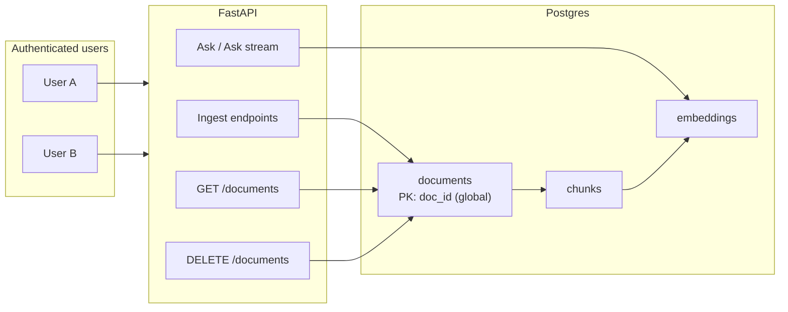

# Shared ingested library — Option A implementation

## Decision

**Option A — full shared library.** All authenticated TrueAI users share one document corpus.

Out of scope (explicitly not required):

- Per-user private uploads
- Admin-only delete or role-based delete
- Ingest attribution / audit via `user_id`

Auth gating (closed signup / allowlist) remains the access boundary.

---

## Target behavior



| Operation | After change |
|-----------|--------------|
| **Ingest** | Writes document without `user_id` (NULL). Global `doc_id` uniqueness unchanged. |
| **List** | All documents for any authenticated user. |
| **Ask / retrieve** | Vector search over entire corpus (optional `doc_id` filter unchanged). |
| **Delete** | Any authenticated user can delete any document by `doc_id`. |
| **Similar titles** | Fuzzy match against all document titles. |

---

## Code changes

### 1. [`app/db.py`](app/db.py)

- **`retrieve_top_k_pg`**: Remove `user_id` parameter and `WHERE d.user_id = %s` branch.
- **`list_documents`**: Remove `user_id` parameter and filter.
- **`list_doc_title_pairs`**: Remove `user_id` parameter; `SELECT doc_id, title FROM documents`.
- **`delete_document_for_user`**: Replace usage with existing **`delete_by_doc_id`** (already deletes embeddings, chunks, document). Optionally add `delete_document(conn, doc_id) -> bool` that returns whether a row existed (for 404 semantics).
- **`insert_document`**: Keep `user_id` column optional for schema compat; callers pass `None`.
- Update docstrings/comments that say "per-user".

### 2. [`app/retrieval.py`](app/retrieval.py)

- Remove `user_id` from `retrieve_top_k` signature and call to `retrieve_top_k_pg`.

### 3. [`app/main.py`](app/main.py)

Endpoints still require auth (`Depends(get_current_user)`) but stop scoping data by user:

| Endpoint | Change |
|----------|--------|
| `ingest_text` helper | Stop accepting/passing `user_id`; `insert_document(..., user_id=None)` |
| `POST /ingest`, `/ingest/file`, `/ingest/google-drive` | Remove `user_id=` from `ingest_text` calls |
| `POST /ask`, `POST /ask/stream` | `retrieve_top_k(...)` without `user_id` |
| `GET /documents` | `list_documents(conn)` without `user_id` |
| `DELETE /documents/{doc_id}` | Use `delete_by_doc_id` or new bool wrapper; 404 if doc missing |
| `GET /documents/similar-titles` | `list_doc_title_pairs(conn)` without `user_id`; update docstring |

Keep `get_current_user` on all these routes — unauthenticated users still get 401.

### 4. Database migration (optional cleanup)

New file e.g. [`supabase/migrations/YYYYMMDD_shared_library.sql`](supabase/migrations/):

```sql
UPDATE documents SET user_id = NULL WHERE user_id IS NOT NULL;
```

Not strictly required once queries ignore `user_id`, but keeps data consistent. No schema change needed.

### 5. Frontend [`frontend/src/components/documents/`](frontend/src/components/documents/)

- UI already uses neutral copy ("Document index", "No documents in the index yet").
- No API contract changes — same endpoints, broader data. Quick smoke test: two users should see the same document list.

### 6. Tests

- No existing tests assert per-user isolation.
- Optional: add a small integration test that two different `user_id` values see the same `list_documents` result (only if test DB harness exists).

---

## What stays the same

- Supabase JWT auth on all document/RAG routes
- Global `doc_id` primary key and duplicate-ingest behavior
- Google Drive single server OAuth token
- RLS policies (app uses `DATABASE_URL`; no RLS change required)

---

## Rollout

1. Deploy backend changes — immediately unblocks cross-user visibility (existing rows with any `user_id` become visible once filters are removed).
2. Run optional `UPDATE documents SET user_id = NULL` in Supabase SQL Editor if desired.
3. Verify: User A ingests → User B sees doc in Documents tab and gets it in Ask retrieval.

---

## Ready to implement

When you say **execute the plan** or **go ahead and implement**, apply the changes above in `app/db.py`, `app/retrieval.py`, and `app/main.py`, plus optional migration file.
