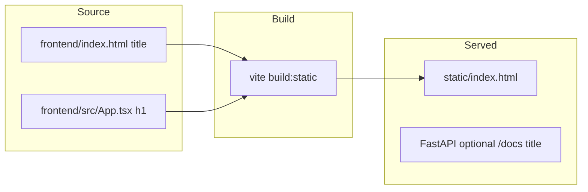

# Rebrand forward-facing UI to TrueAI

## Scope (what users actually see)

| Location | Current | Change |
|----------|---------|--------|
| [frontend/src/App.tsx](frontend/src/App.tsx) | `<h1>Verbiage</h1>` on the signed-out shell (line ~35) and signed-in header (line ~57) | Replace with **TrueAI** |
| [frontend/index.html](frontend/index.html) | `<title>frontend</title>` | Set to **TrueAI** (or **TrueAI — Document RAG** if you want a longer tab label) |

The tagline lines (*“Document RAG workspace — sign in to continue.”* / *“RAG on your ingested reports”*) can stay as-is unless you want product copy to mention TrueAI explicitly there too.

## Build / deploy path

Production uses Vite with `DEPLOY_STATIC=1`, which writes into [`static/`](static/) ([Dockerfile](Dockerfile) copies `/build/static` → `./static`). After editing `frontend/index.html`, run `npm run build:static` in `frontend/` (or your usual Docker build) so [`static/index.html`](static/index.html) picks up the new `<title>`. **Do not** hand-edit `static/index.html` long-term; it is build output.

## Optional “nice to have” (not required for basic branding)

- **Swagger UI (`/docs`)**: [`app/main.py`](app/main.py) uses `FastAPI(lifespan=lifespan)` with no `title`. You can add e.g. `FastAPI(title="TrueAI", lifespan=lifespan)` so the API docs banner matches the product name.
- **Reference tree**: If you keep [`files_for_reference/frontend/`](files_for_reference/frontend/) in sync with the real app, mirror the same `App.tsx` + `index.html` edits there.
- **LocalStorage key**: [`frontend/src/hooks/useStreamingAsk.ts`](frontend/src/hooks/useStreamingAsk.ts) uses `verbiage-chat-messages`. Renaming to something like `trueai-chat-messages` is *not* user-visible but would **clear existing users’ cached chat** in the browser unless you add a one-time migration. Default recommendation: **leave as-is** unless you care about internal naming consistency.

## Out of scope (unless you ask to expand)

- Repo folder name, `POSTGRES_DB`, default `verbiage.db`, log file `verbiage.log`, internal comments, and docs like [README.md](README.md) / [overview.md](overview.md) — these are not “forward facing” in the browser; changing them is a separate hygiene pass.

