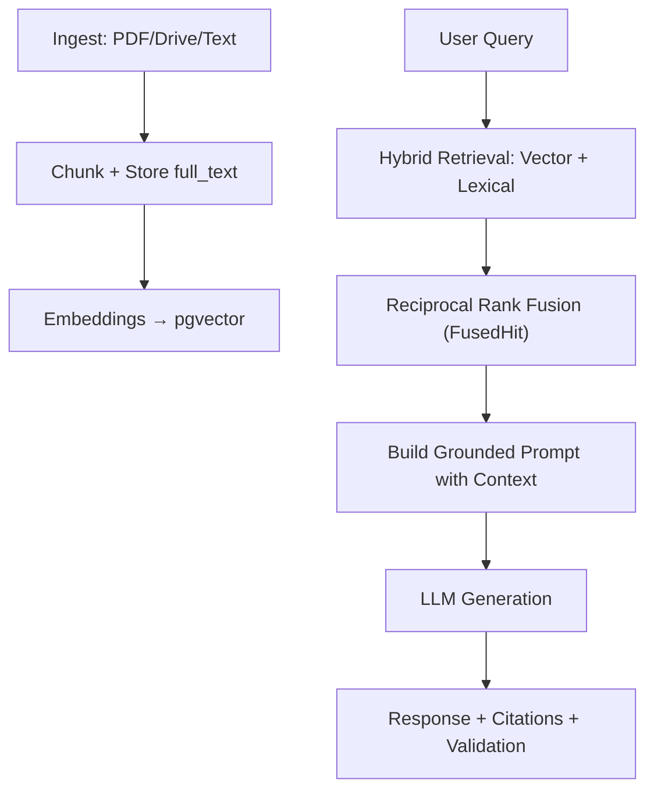

# Verbiage — AI-Powered RAG for Storm Damage Reports

**Production-grade Retrieval-Augmented Generation system** built to help engineering teams quickly find relevant language from past storm inspection reports when drafting new ones.

**FastAPI + PostgreSQL (pgvector) + Hybrid Search** with a strong emphasis on reliability, grounding, and practical usability for field inspection workflows.

**Production:** [Render dashboard](https://dashboard.render.com/web/srv-d6m79eftskes73dnndb0) · live app linked from [overview.md](overview.md).

---

## 🎯 Business Impact

- Dramatically reduces time spent manually searching through old reports
- Improves consistency in report language across the team
- Enforces **strict grounding** — responses always cite real past reports or clearly state when information is insufficient
- Supports a collaborative workflow via a shared document library + Google Drive integration

---

## ✨ Key Features

- **Multi-source ingestion**: PDF upload, text paste, and **Google Drive** sync (Docs, PDF, DOCX via read-only Drive)
- **Hybrid retrieval (RRF)**: The **default** retrieval mode — combines vector embeddings (semantic) + lexical full-text search, fused with Reciprocal Rank Fusion via the `FusedHit` dataclass. An opt-in **`auto`** mode adaptively routes each query (lexical for short exact-term lookups, hybrid otherwise)
- **Smart chunking**: Paragraph-first with canonical `full_text` storage for easy re-indexing without re-upload
- **Strong grounding & validation**: LLM responses include source citations + fallback logic ("Not enough information")
- **Production reliability**: Async ingestion/background tasks, input validation, and structured logging
- **Flexible LLM backend**: OpenAI (production) or Ollama (local/dev)
- **Shared library**: All signed-in users see the same document set; list, filter, delete
- **Drive workflow**: Team inbox via **`GOOGLE_DRIVE_DEFAULT_FOLDER_ID`**, with **Indexed / Not indexed / Stale** status badges; paste another folder URL to override

Embeddings and LLM: **OpenAI** when `OPENAI_API_KEY` is set, otherwise **Ollama**. Auth: **Supabase JWT** on protected routes.

---

## 🛠 Tech Stack

| Layer            | Technology                                              |
|------------------|--------------------------------------------------------|
| Backend          | FastAPI, Pydantic v2, async Python                     |
| Vector DB        | PostgreSQL + pgvector (Supabase in production)         |
| Search           | Hybrid (embeddings + lexical) + Reciprocal Rank Fusion |
| LLM / Embeddings | OpenAI or Ollama                                       |
| Frontend         | React + Vite SPA (TanStack Query)                      |
| Auth             | Supabase JWT                                           |
| Drive            | Google Drive API (read-only OAuth)                     |
| Deployment       | Docker, Render                                         |

---

## Architecture



1. Document uploaded, pasted, or exported from Drive
2. Text extracted → `full_text` saved → chunked (paragraph-first default) → embedded
3. Vectors stored in pgvector; retrieval filtered by active embedding model
4. User question → hybrid retrieval (vector + lexical) → RRF fusion → top-k chunks → grounded LLM response with citations

Implementation notes (chunking, reindex, data sources): [code-notes.md](code-notes.md). Prompt engineering & grounding strategy: [build-prompts.md](build-prompts.md).

---

## 🔧 Recent Improvements & Lessons Learned

| Improvement | Why It Was Added | Impact |
|-------------|------------------|--------|
| **Hybrid search + `FusedHit` RRF** | Pure semantic search struggled with specific technical queries (e.g. "hail damage in Wyoming" or "torn shingles") | Significantly better recall on domain-specific storm-damage language |
| **Async endpoints & background tasks** | Synchronous ingestion blocked the API during large uploads (200+ reports), causing 502 errors | Much more reliable under real team usage loads |
| **Strict grounding prompt + citations** | Reduce hallucinations and ensure answers are traceable to source reports | Builds team trust — every response either cites documents or says "Not enough information" |
| **Canonical `full_text` storage** | Support re-indexing and chunking improvements without re-uploading | Faster iteration during development |

---

## 🚀 Quick Start

**Detailed setup:** [setup.md](setup.md) · **Testing & curl:** [setup_and_testing.md](setup_and_testing.md)

### Docker

```bash
cd verbiage
cp .env.example .env
# Set OPENAI_API_KEY and/or configure Ollama; DATABASE_URL is set by Compose
docker-compose up --build
```

Open **http://localhost:8000/** for the built SPA. Stop with `docker-compose down`.

### Local dev (API + Vite hot reload)

Two terminals — API on `:8000`, Vite on `:5173` (proxies API). See [setup.md](setup.md#local-development-vite--uvicorn-hot-reload-spa).

```bash
python3 -m venv .venv && source .venv/bin/activate
pip install -r requirements.txt
cp .env.example .env   # DATABASE_URL required
uvicorn app.main:app --reload
```

---

## Web UI (SPA)

After sign-in:

| Tab | Purpose |
|-----|---------|
| **Ask** | Chat over the shared library with source citations |
| **Documents** | Index table, PDF upload, search, delete |
| **Google Drive** | Team inbox (env default); list Docs/PDF/DOCX; status badges; ingest selected files |

---

## API highlights

Interactive docs: **http://localhost:8000/docs** when the server is running.

| Route | Notes |
|-------|--------|
| `GET /health` | Liveness (process up) |
| `GET /health/ready` | Readiness (Postgres) — use for Render/LB health checks |
| `GET /documents` | Shared library listing |
| `POST /documents/{doc_id}/reindex` | Re-chunk/re-embed from stored `full_text` |
| `GET /drive/files` | Drive folder list + `index_status` / `summary` |
| `POST /ingest/google-drive` | Fetch and ingest Drive files (GDoc, PDF, DOCX) |
| `POST /ask`, `POST /ask/stream` | RAG Q&A |

Most routes require `Authorization: Bearer <Supabase access token>`.

---

## 🎓 Technical Decisions & Tradeoffs

- **Hybrid search (default)**: Chosen after testing showed it outperforms pure vector search on specific storm-report queries (hail, shingles, wind speeds, locations, etc.), so it's the default retrieval mode. RRF fuses the vector and lexical lists without needing comparable score scales. An opt-in `auto` mode routes short exact-term lookups to lexical and everything else to hybrid.
- **Grounding strategy**: Explicit system prompt + source injection + validation step to maintain reliability in production.
- **Async migration**: A lesson learned from real ingest testing — essential for production scalability when ingesting large batches of reports.
- **Canonical `full_text`**: Lets chunking/embedding strategies evolve via reindex instead of re-upload.

This project demonstrates full-cycle applied AI engineering: business problem → reliable RAG system → continuous iteration based on testing and user needs.

---

## 📋 Project Structure

- `/app` — Core FastAPI RAG logic (ingestion, chunking, retrieval, generation)
- `/frontend` — React + Vite SPA
- [build-prompts.md](build-prompts.md) — Prompt engineering & grounding strategy
- [code-notes.md](code-notes.md) — Chunking, retrieval, and technical decisions
- [setup.md](setup.md) · [setup_and_testing.md](setup_and_testing.md) — Setup, testing, and curl examples

---

## Health & ops

- Set the load-balancer health check to **`/health/ready`**, not `/health`.
- Optional **`GET /health/deep`** probes DB + embed (avoid high-frequency polling — may call OpenAI).
- Optional Prometheus **`GET /metrics`** — see [setup.md](setup.md#prometheus-metrics-optional).

---

## 📬 Contact

**Rebecca Clarke** — [LinkedIn](https://www.linkedin.com/) · [Email](mailto:your-email@example.com)
