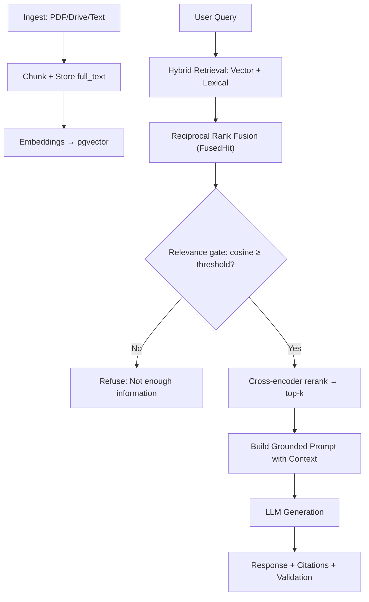

# Verbiage — AI-Powered RAG for Storm Damage Reports

**Production-grade Retrieval-Augmented Generation system** built to help engineering teams quickly find relevant language from past storm inspection reports when drafting new ones.

**FastAPI + PostgreSQL (pgvector) + Hybrid Search** with a strong emphasis on reliability, grounding, and practical usability for field inspection workflows.

**Live app:** [rag-document-analysis-backend.onrender.com](https://rag-document-analysis-backend.onrender.com) (sign-in required) · deployed on Render. More background in [overview.md](overview.md).

---

## Demo (no login required)

The production app requires sign-in, so the examples below show typical **Ask** behavior from the faithfulness eval corpus ([tests/eval/gold_questions.yaml](tests/eval/gold_questions.yaml)). Answers are grounded in retrieved report text and include **source citations** (document title + excerpt). Off-corpus questions are **refused** before any LLM call when retrieval scores are too low.

**Answerable question** — retrieval finds relevant storm-report language:

> **Q:** What roof damage was found at 1060 Alton Road in Port Charlotte?
>
> **A:** *(Suggested overview / detailed-image verbiage drawn from matching inspection reports, with cited source chunks — e.g. shingle damage, wind-related observations.)*

**Refusal** — nothing relevant in the shared library:

> **Q:** What hail damage was found on roofs in Wyoming?
>
> **A:** *I don't have relevant context in the document library to answer that question.*

Optional polish: add UI screenshots under [`docs/screenshots/`](docs/screenshots/) and embed them here — **not required**; the text examples above are enough for a portfolio README.

---

## 🎯 Business Impact

- Dramatically reduces time spent manually searching through old reports
- Improves consistency in report language across the team
- Enforces **strict grounding** — responses always cite real past reports or clearly state when information is insufficient
- Supports a collaborative workflow via a shared document library + Google Drive integration

---

## ✨ Key Features

- **Multi-source ingestion**: PDF upload, text paste, and **Google Drive** sync (Docs, PDF, DOCX via read-only Drive)
- **Adaptive retrieval (`auto`, default)**: Each query is routed per-shape — short exact-term/identifier lookups go to lexical full-text search, everything else to **hybrid retrieval (RRF)**, which combines vector embeddings (semantic) + lexical full-text search fused with Reciprocal Rank Fusion via the `FusedHit` dataclass. `vector`, `lexical`, and `hybrid` remain selectable explicitly
- **Cross-encoder reranking (optional, `RERANK_ENABLED`)**: Retrieval pulls a wider candidate pool, then a cross-encoder (`ms-marco-MiniLM-L-6-v2`) reranks it down to the final top-k — sharpening the context before the prompt. Warmed on startup, loaded lazily, and a no-op when disabled (kept off in tests/CI to avoid the model load)
- **Smart chunking**: Paragraph-first with canonical `full_text` storage for easy re-indexing without re-upload
- **Strong grounding & validation**: LLM responses include source citations + fallback logic ("Not enough information"), plus a **pre-LLM relevance gate** — off-corpus questions are refused before any LLM call when the best chunk's cosine similarity falls below `RAG_MIN_RELEVANCE_SCORE` (deterministic, zero-spend refusals)
- **Production reliability**: Durable **Postgres-backed ingest job queue** with a background worker (batch enqueue + status polling), input validation, and structured logging
- **Observability**: Optional Prometheus `/metrics`, including a low-quality-retrieval counter (`rag_retrieval_low_quality_total`) for alerting when top-1 similarity is weak
- **Flexible LLM backend**: OpenAI (production) or Ollama (local/dev); PostgreSQL (Supabase) in production or SQLite for local dev
- **Access control**: Supabase JWT on protected routes, with **closed signup** via invite code or email allowlist and a password-reset flow
- **Shared library**: All signed-in users see the same document set; list, filter, delete
- **Drive workflow**: Team inbox via **`GOOGLE_DRIVE_DEFAULT_FOLDER_ID`**, with **Indexed / Not indexed / Stale** status badges; paste another folder URL to override

Embeddings and LLM: **OpenAI** when `OPENAI_API_KEY` is set, otherwise **Ollama**. Auth: **Supabase JWT** on protected routes.

---

## 🛠 Tech Stack

| Layer            | Technology                                              |
|------------------|--------------------------------------------------------|
| Backend          | FastAPI, Pydantic v2, async Python                     |
| Vector DB        | PostgreSQL + pgvector (Supabase in production)         |
| Search           | Hybrid (embeddings + lexical) + Reciprocal Rank Fusion |
| Reranking        | Cross-encoder (`ms-marco-MiniLM-L-6-v2`, optional)     |
| LLM / Embeddings | OpenAI or Ollama                                       |
| Frontend         | React + Vite SPA (TanStack Query)                      |
| Auth             | Supabase JWT                                           |
| Drive            | Google Drive API (read-only OAuth)                     |
| Deployment       | Docker, Render                                         |

---

## Architecture



1. Document uploaded, pasted, or exported from Drive
2. Text extracted → `full_text` saved → chunked (paragraph-first default) → embedded
3. Vectors stored in pgvector; retrieval filtered by active embedding model
4. User question → hybrid retrieval (vector + lexical) → RRF fusion → relevance gate (cosine) → optional cross-encoder rerank → top-k chunks → grounded LLM response with citations

### Concurrency model

We chose **psycopg2** and a **sync DB layer** first because the app migrated from SQLite with minimal churn — same `conn`-per-request pattern, straightforward pgvector SQL, and one `ThreadedConnectionPool` against the Supabase pooler. We used **native async (`httpx`)** for LLM and embedding API calls from the start because that is where most `/ask` latency lives. As load grew on a **single uvicorn worker** (ingest worker in-process, reranker in memory), blocking work on the event loop caused real pain — first **Google Drive listing** (502s on large folders), then the **cross-encoder reranker**. We addressed those with **`asyncio.to_thread`** (and a dedicated Drive thread pool), not an asyncpg rewrite: same database, same pooler, lower risk. Remaining gaps — **Postgres retrieval, document chunking, PDF/DOCX extraction, and worker Drive downloads** — are offloaded the same way so concurrent `/ask` and ingest do not freeze health checks or SSE streams.

Implementation notes (chunking, reindex, data sources): [code-notes.md](code-notes.md). Prompt engineering & grounding strategy: [build-prompts.md](build-prompts.md).

---

## 🔧 Recent Improvements & Lessons Learned

| Improvement | Why It Was Added | Impact |
|-------------|------------------|--------|
| **Hybrid search + `FusedHit` RRF** | Pure semantic search struggled with specific technical queries (e.g. "hail damage in Wyoming" or "torn shingles") | Significantly better recall on domain-specific storm-damage language |
| **Cross-encoder reranking** | Top-k straight from RRF still surfaced near-duplicates and loosely-related chunks | A wider candidate pool reranked by a cross-encoder sharpens the final context sent to the LLM |
| **Pre-LLM relevance gate** | Off-corpus questions still reached the model and risked confident hallucination | Refuses below a cosine threshold *before* any LLM call — no spend, deterministic refusal |
| **Postgres-backed ingest job queue** | Synchronous ingestion blocked the API during large uploads (200+ reports), causing 502 errors | Durable batch jobs + status polling; reliable under real team usage loads |
| **Strict grounding prompt + citations** | Reduce hallucinations and ensure answers are traceable to source reports | Builds team trust — every response either cites documents or says "Not enough information" |
| **Canonical `full_text` storage** | Support re-indexing and chunking improvements without re-uploading | Faster iteration during development |
| **Event-loop offload (`to_thread`)** | Sync psycopg2 + chunking/PDF/Drive still blocked the single worker under concurrency | Retrieval, ingest CPU work, and worker Drive fetch moved off the loop; LLM/embed stay native async |

---

## 🚀 Quick Start

**Detailed setup:** [setup.md](setup.md) · **Testing & curl:** [setup_and_testing.md](setup_and_testing.md)

### Docker

```bash
cd verbiage
cp .env.example .env
# Set OPENAI_API_KEY and/or configure Ollama; DATABASE_URL is set by Compose
docker-compose up --build
```

Open **http://localhost:8000/** for the built SPA. Stop with `docker-compose down`.

### Local dev (API + Vite hot reload)

Two terminals — API on `:8000`, Vite on `:5173` (proxies API). See [setup.md](setup.md#local-development-vite--uvicorn-hot-reload-spa).

```bash
python3 -m venv .venv && source .venv/bin/activate
pip install -r requirements.txt
cp .env.example .env   # DATABASE_URL required
uvicorn app.main:app --reload
```

### Deploy (Render)

Deployed on Render from the [Dockerfile](Dockerfile); [render.yaml](render.yaml) is a [Blueprint](https://render.com/docs/blueprint-spec) with **two services**:

| Service | Role |
|---------|------|
| **Web** (`rag-document-analysis-backend`) | API, Report Writer, RAG, SPA |
| **Worker** (`rag-ingest-worker`) | Drive ingest + claim photo vision jobs (`python -m app.worker_main`) |

**Small instances (<2GB RAM):**

- Web sets **`RERANK_ENABLED=0`** — skips the ~100MB cross-encoder and avoids `/health/ready` 503s during reranker warm-up. `/ask` uses RRF fusion only until you upgrade and re-enable reranker.
- Web sets **`INGEST_WORKER_ENABLED=0`** — background jobs run on the worker service so OOM during photo analysis does not restart the API.
- Size both services in the Render dashboard (Starter minimum for production).

**Health check** → `/health/ready` (Postgres only when reranker disabled).

Secrets (`DATABASE_URL`, `OPENAI_API_KEY`, `SUPABASE_*`, `GOOGLE_*`, …) use `sync: false` — managed in the Render dashboard.

#### Stuck photo analysis (ops)

If the UI shows “Analyzing photos…” for hours after a server restart/OOM:

1. Click **Retry stuck photos** in Report Writer (calls `POST /report-writer/claims/{id}/photos/retry-stuck`).
2. Or run the SQL in [setup.md](setup.md#stuck-photo-analysis) in Supabase SQL Editor, then **Confirm & start analysis** once.

The ingest worker reclaims ingest jobs stuck in `running` for **`STALE_JOB_MINUTES`** (default 15) on startup and every 10 minutes.

---

## Faithfulness eval

A regression harness that answers one question after every retrieval/prompt tweak: **is every claim in an answer supported by the context that was actually retrieved?** It runs the real pipeline (`auto` routing -> RRF -> grounded prompt -> LLM) against a frozen corpus seeded into a throwaway pgvector container, then judges each answer's claims.

```bash
make eval        # fast gate: local NLI judge (sentence-transformers), run every tweak
make eval-full   # deep gate: OpenAI LLM-as-judge, nightly/manual
```

Each `make` target brings the ephemeral DB up (`docker-compose.eval.yml`), seeds `tests/eval/corpus/`, runs the suite, prints a per-question scoreboard, and tears the DB down. The whole suite is opt-in via `VERBIAGE_EVAL=1`, so a normal `pytest` run stays fast and offline. Gold questions (including deliberately unanswerable ones that must trigger a refusal) live in [tests/eval/gold_questions.yaml](tests/eval/gold_questions.yaml). Generation needs an LLM backend (OpenAI key or Ollama) and an embedding backend (or a warm `tests/eval/embeddings_cache.json`; refresh with `make eval-warm-cache`).

**CI vs eval:** GitHub Actions runs `pytest -q` on every push (unit/integration tests, no LLM). The faithfulness harness is **`make eval`** locally or on a schedule — heavier, needs Docker + an LLM backend. See [setup_and_testing.md](setup_and_testing.md).

---

## Web UI (SPA)

After sign-in:

| Tab | Purpose |
|-----|---------|
| **Ask** | Chat over the shared library with source citations |
| **Documents** | Index table, PDF upload, search, delete |
| **Google Drive** | Team inbox (env default); list Docs/PDF/DOCX; status badges; ingest selected files |

---

## API highlights

Interactive docs: **http://localhost:8000/docs** when the server is running.

| Route | Notes |
|-------|--------|
| `GET /health` | Liveness (process up) |
| `GET /health/ready` | Readiness (Postgres; reranker warm-up when `RERANK_ENABLED=1`) — Render health check |
| `GET /documents` | Shared library listing |
| `POST /documents/{doc_id}/reindex` | Re-chunk/re-embed from stored `full_text` |
| `GET /drive/files` | Drive folder list + `index_status` / `summary` |
| `POST /ingest/google-drive` | Enqueue a batch of Drive files (GDoc, PDF, DOCX) for the worker |
| `GET /ingest/batches/{batch_id}` | Poll async ingest batch progress |
| `POST /ask`, `POST /ask/stream` | RAG Q&A |

Most routes require `Authorization: Bearer <Supabase access token>`.

---

## Security & access model

This app is a **team shared library**, not per-user document isolation:

- **API auth:** Protected routes require a valid **Supabase JWT** (`Authorization: Bearer …`). Sign-up is **closed** (invite code or email allowlist).
- **Shared corpus:** All authenticated users see the same ingested documents — ingest, list, search, and delete apply to one team library (intentional for a collaborative storm-report inbox).
- **Database access:** The FastAPI service connects with **`DATABASE_URL`** (Postgres owner role), which **bypasses Row Level Security**. RLS policies on `documents` / `chunks` / `embeddings` are defined for Supabase-native clients (`authenticated` role); they document how direct Supabase access would be scoped if you add client-side DB reads later. Today all data access goes through the API.

---

## 🎓 Technical Decisions & Tradeoffs

- **Adaptive `auto` routing (default)**: Each query is routed by shape — short exact-term/identifier lookups (`WY-2024`, quoted phrases) to lexical, everything else to hybrid. Hybrid was chosen after testing showed it outperforms pure vector search on specific storm-report queries (hail, shingles, wind speeds, locations, etc.); RRF fuses the vector and lexical lists without needing comparable score scales. Contractions/possessives (`what's`, `owner's`) are not treated as quoting, so natural-language questions stay on hybrid. When a query is routed to lexical because of a quoted phrase, only the quoted phrase is searched (not the verbose wrapper, whose terms would AND to no match), and if the adaptive lexical route returns nothing it falls back to hybrid — so `auto` never does worse than the hybrid default. `vector`/`lexical`/`hybrid` can still be requested explicitly.
- **Reranking after fusion**: RRF is great at *recall* but order is rank-based, so a cross-encoder reranks a wider candidate pool by true query–document relevance before prompt assembly. Kept optional (`RERANK_ENABLED`) and lazy-loaded so tests/CI never pay the ~100MB model cost.
- **Gate on cosine, before the LLM**: The relevance gate evaluates the cosine component regardless of retrieval mode — RRF and `ts_rank` magnitudes aren't comparable across queries, so cosine is the only signal that says anything about *absolute* relevance. Refusing below the threshold avoids both hallucinations and wasted LLM spend on off-corpus questions.
- **Grounding strategy**: Explicit system prompt + source injection + validation step to maintain reliability in production.
- **Durable ingest queue**: A lesson learned from real ingest testing — synchronous ingestion of large batches caused 502s, so ingestion moved to a Postgres-backed job queue with a background worker and pollable batch status.
- **Canonical `full_text`**: Lets chunking/embedding strategies evolve via reindex instead of re-upload.

This project demonstrates full-cycle applied AI engineering: business problem → reliable RAG system → continuous iteration based on testing and user needs.

---

## 📋 Project Structure

- `/app` — Core FastAPI RAG logic (ingestion, chunking, retrieval, reranking, generation)
- `/frontend` — React + Vite SPA
- `/tests` — Unit/integration suite + the opt-in faithfulness eval harness (`tests/eval/`)
- [build-prompts.md](build-prompts.md) — Prompt engineering & grounding strategy
- [code-notes.md](code-notes.md) — Chunking, retrieval, and technical decisions
- [setup.md](setup.md) · [setup_and_testing.md](setup_and_testing.md) — Setup, testing, and curl examples

---

## Health & ops

- Set the load-balancer health check to **`/health/ready`**, not `/health`.
- Optional **`GET /health/deep`** probes DB + embed (avoid high-frequency polling — may call OpenAI).
- Optional Prometheus **`GET /metrics`** — see [setup.md](setup.md#prometheus-metrics-optional); local **Grafana** stack in [observability/](observability/README.md).

---

## 📬 Contact

**Rebecca Clarke** — [LinkedIn](https://www.linkedin.com/in/rclarke009/) · [Email](mailto:rivkaclarke@icloud.com)

## License

[MIT](LICENSE)
