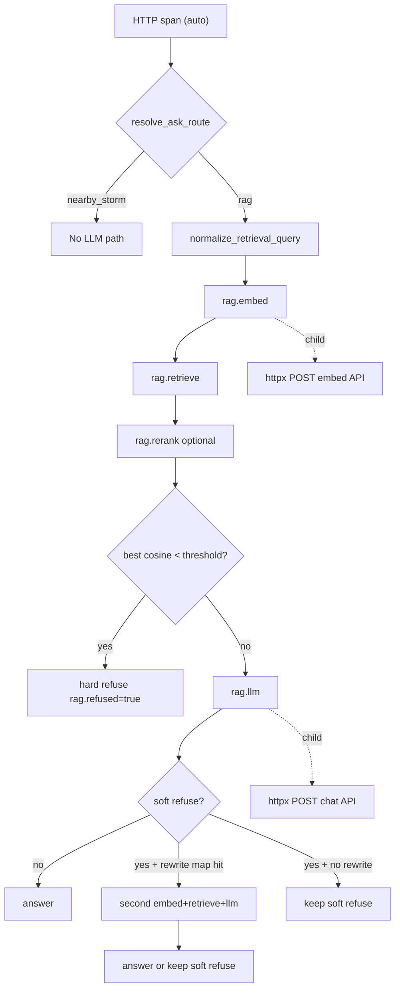

# OpenTelemetry tracing — architecture notes

This doc explains **why** we instrumented the RAG pipeline the way we did, and how the pieces connect. Read it alongside the code in [`app/monitoring/tracing.py`](../app/monitoring/tracing.py) and the ask handlers in [`app/main.py`](../app/main.py).

## Metrics vs traces (both, on purpose)

| Signal | Question it answers | Verbiage home |
|--------|---------------------|---------------|
| **Metrics** (Prometheus) | "What is p95 embed latency across all traffic?" | [`app/monitoring/metrics.py`](../app/monitoring/metrics.py) |
| **Traces** (OpenTelemetry) | "Why was *this* `/ask` slow?" | [`app/monitoring/tracing.py`](../app/monitoring/tracing.py) |

We did **not** replace Prometheus. Histograms like `rag_phase_seconds` stay the source of truth for dashboards and alerts. Traces add a **per-request span tree** you can inspect in Grafana Explore when debugging one bad request.

## The RAG pipeline (what we trace)

Both `/ask` and `/ask/stream` follow the same phases — see `_retrieve_for_ask` and `_run_ask_rag_with_corrective` in [`app/main.py`](../app/main.py):



**Why these boundaries?** They match the existing `record_rag_phase_seconds("embed"|"retrieve"|"llm", ...)` calls. Same seams = metrics and traces stay comparable. A rewrite-once retry repeats embed / retrieve / llm under the same HTTP parent and sets `rag.rewrite_once` on that root span.

## Design decisions

### 1. `OTEL_ENABLED` defaults off

Tests and production without a collector should pay **zero** export cost. Same pattern as `METRICS_ENABLED` in [`app/config.py`](../app/config.py).

### 2. Auto-instrument FastAPI + httpx; manual spans for RAG phases

- **FastAPIInstrumentor** — creates the parent HTTP span (`POST /ask`) with route template labels. You don't maintain this by hand. Must be called at **import time** (right after `app = FastAPI(...)`), not in lifespan startup — otherwise middleware is registered too late and each `rag.*` span becomes its own orphan trace.
- **HTTPXClientInstrumentor** — creates child spans for OpenAI/Ollama HTTP calls inside [`app/llm_client.py`](../app/llm_client.py) and embedders **without editing those files**. Keeps instrumentation out of those modules while still attributing outbound HTTP cost to the parent RAG span.
- **`rag_phase_span()`** — manual spans for domain-specific phases Prometheus already names. Only RAG code knows about retrieve modes, relevance gates, and rerank.

### 3. Span names mirror Prometheus phase labels

| Span | Prometheus `phase` label |
|------|--------------------------|
| `rag.embed` | `embed` |
| `rag.retrieve` | `retrieve` |
| `rag.rerank` | (no separate metric yet — nested under retrieve timing) |
| `rag.llm` | `llm` |

When you see a spike in `rag_phase_seconds{phase="llm"}`, search Tempo for traces with a long `rag.llm` child span.

### 4. Low-cardinality attributes only

We attach **outcome metadata**, not content:

| Attribute | Meaning |
|-----------|---------|
| `rag.endpoint` | `sync` or `stream` |
| `rag.route` | `rag` or `nearby_storm` |
| `rag.retrieval_mode` | Resolved mode (`hybrid`, `vector`, `lexical`) — not raw `auto` |
| `rag.auto_routed` | Whether `auto` mode picked lexical vs hybrid |
| `rag.chunk_count` | Chunks after retrieve (before prompt trim) |
| `rag.top_cosine` | Best cosine when available (gate signal) |
| `rag.gate_blocked` | Relevance gate cleared chunks |
| `rag.refused` | **Hard** refusal only — fixed no-context reply before any LLM call |
| `rag.rewrite_once` | Soft refuse triggered one corrective retrieve (`true` only when rewrite ran) |
| `rag.rewrite_query` | Rewritten retrieval string (truncated); set only with `rag.rewrite_once` |
| `rag.original_query` | Original user question (truncated); set only with `rag.rewrite_once` |

**Default rule:** do not put question text, chunk content, or doc IDs on spans — PII risk and cardinality explosion in Tempo. Rewrite attributes are a deliberate exception (truncated, only on corrective retries) for debugging false soft refuses.

### 5. Collector in front of Tempo

```
Verbiage → OTLP :4318 → OTel Collector → Tempo :4317 → Grafana Explore
```

The app talks to the **collector**, not Tempo directly. Collectors batch, retry, and can fan out to multiple backends later (Jaeger, cloud vendors) without changing app code.

### 6. `BatchSpanProcessor` vs `SimpleSpanProcessor`

- **Production / app:** `BatchSpanProcessor` — buffers spans, exports in background so OTLP never blocks request handling.
- **Tests:** `SimpleSpanProcessor` + `InMemorySpanExporter` — synchronous, no network. See [`tests/test_tracing.py`](../tests/test_tracing.py).

### 7. Log correlation (TraceContextFilter)

When tracing is on, log records get `trace_id` and `span_id` fields (printed in the log format). Each `/ask` also emits a structured JSON line (`event=ask_run`) and returns the same summary on `AskResponse.ask_run` / SSE — see **[ask-run-diagnosis.md](ask-run-diagnosis.md)**. Shipping those lines to Loki for click-through from Tempo remains a future step.

## Code map

| File | Role |
|------|------|
| [`app/monitoring/tracing.py`](../app/monitoring/tracing.py) | SDK setup, `rag_phase_span`, attribute helpers |
| [`app/main.py`](../app/main.py) | `init_tracing` at import time; spans on ask paths; rewrite-once corrective |
| [`app/corrective.py`](../app/corrective.py) | Soft-refuse detection + `rewrite_query_for_retry` |
| [`app/retrieval.py`](../app/retrieval.py) | `normalize_retrieval_query` (topic for embed/lexical) |
| [`app/monitoring/metrics.py`](../app/monitoring/metrics.py) | Unchanged Prometheus helpers (kept alongside traces) |
| [`observability/docker-compose.yml`](../observability/docker-compose.yml) | Collector + Tempo + existing Prometheus/Grafana |
| [`observability/otel-collector-config.yaml`](../observability/otel-collector-config.yaml) | OTLP in → Tempo out |

## Production (Render)

For env vars, Grafana Cloud OTLP, and an incident playbook without a code push, see **[prod-observability.md](prod-observability.md)**.

## Local workflow

1. In `.env`:
   ```bash
   OTEL_ENABLED=true
   OTEL_SERVICE_NAME=verbiage
   OTEL_EXPORTER_OTLP_ENDPOINT=http://localhost:4318
   METRICS_ENABLED=true   # optional but nice to compare both signals
   ```
2. Restart the API (e.g. `uvicorn app.main:app --reload --port 8000`). Restart again after changing any `OTEL_*` var — tracing initializes at import time; editing `.env` alone does not trigger `--reload`.
3. `cd observability && docker compose up -d`
4. Ask a question in the app.
5. Grafana → **Explore** → datasource **Tempo** → **Search** → use a query that excludes metrics noise (see below). Set time range to **Last 15 minutes**.
6. Open a trace: you should see `POST /ask` → `rag.embed` → httpx child → `rag.retrieve` → optional `rag.rerank` → `rag.llm` → httpx child. A rewrite-once retry adds a second embed/retrieve/llm block under the same HTTP parent (`rag.rewrite_once=true` on the root).

## Reading a trace (what you are seeing)

A healthy streaming ask looks like this in the Tempo waterfall:

```
POST /ask/stream                    3.4s   ← HTTP parent (FastAPI auto-instrumentation)
├── rag.embed                       584ms  ← embed the user's question
│   └── POST                        581ms  ← httpx child → OpenAI embeddings API
├── rag.retrieve                    140ms  ← hybrid/vector/lexical DB search
├── rag.llm                         2.6s   ← generate answer (often dominates total time)
│   └── POST                        505ms  ← httpx child → OpenAI chat/completions
└── POST /ask/stream http send × N   ~µs   ← one tiny span per SSE chunk sent to browser
```

| Span | What it means |
|------|---------------|
| **Root (`POST /ask` or `POST /ask/stream`)** | Wall-clock for the whole request |
| **`rag.embed`** | Embed phase; almost all time is usually the httpx **POST** child (OpenAI) |
| **`rag.retrieve`** | Postgres/pgvector search — no httpx child (local DB) |
| **`rag.rerank`** | Optional; nested under retrieve when `RERANK_ENABLED=1` and multiple candidates |
| **`rag.llm`** | Full LLM phase: rate limit, call model, stream tokens, yield SSE events |
| **POST under embed/llm** | Outbound HTTP to OpenAI/Ollama (httpx auto-instrumentation) |
| **`http send` (many, stream only)** | FastAPI ASGI instrumentation for each SSE chunk — safe to ignore for latency analysis |

**Key insight:** If `rag.llm` is much longer than its httpx **POST** child, most LLM time is token streaming and SSE delivery, not the initial HTTP round-trip.

### Two kinds of "refusal" (and optional rewrite)

Verbiage can decline to answer in two ways. Soft refuse may also trigger **one** corrective retrieve when [`rewrite_query_for_retry`](../app/corrective.py) returns a domain phrase. Traces look different — do not conflate them.

| | **Hard refusal** (relevance gate) | **Soft refusal** (LLM) | **Soft refuse + rewrite-once** |
|---|-----------------------------------|------------------------|-------------------------------|
| **When** | Empty chunks or best cosine &lt; `RAG_MIN_RELEVANCE_SCORE` (0.5) | Chunks pass the gate but model returns the soft-refuse canary | Soft refuse **and** phrase map matches (e.g. intact tiles / storm-created opening) |
| **UI message** | *"I don't have relevant context to answer that question."* | *"No source documents contain that information."* (if rewrite skipped or second pass still soft) | May become a grounded answer after the second LLM |
| **`rag.llm` span** | **Absent** | **Present** (one) | **Two** LLM phases (first soft, second retry) |
| **`rag.refused` attribute** | `true` on root HTTP span | **Not set** | **Not set** (unless second retrieve hard-gates; first soft answer is kept) |
| **Rewrite attrs** | — | — | `rag.rewrite_once=true`, truncated `rag.original_query` / `rag.rewrite_query` |
| **Prometheus** | `rag_no_context_response_total` increments | Normal LLM phase metrics | Extra embed/retrieve/llm phase samples |

Embed and retrieve always use [`normalize_retrieval_query`](../app/retrieval.py) so instructional wrappers do not dilute cosine below the gate; the LLM prompt still receives the **original** user question.

**Hard refusal trace** (gate blocks before LLM — e.g. off-topic question like *"What is the recipe for chocolate chip cookies?"*):

```
POST /ask/stream     ~1–2s
├── rag.embed
├── rag.retrieve     ← rag.gate_blocked=true, low rag.top_cosine
└── (no rag.llm)     ← rag.refused=true on root span
```

**Soft refusal, no rewrite** (retrieval passes gate, model rejects context, phrase map misses — e.g. *"Summarize the earthquake and seismic foundation damage reported in the inspections."* on a storm-only library):

```
POST /ask/stream     ~3–5s
├── rag.embed
├── rag.retrieve     ← rag.chunk_count > 0, rag.top_cosine likely ≥ 0.5, no gate_blocked
├── rag.llm          ← short LLM phase; model returns fixed "no source documents" line
│   └── POST         ← chat/completions still called
└── http send × N
```

**Soft refuse + rewrite-once** (phrase map hits — second pass under the same HTTP parent):

```
POST /ask/stream
├── rag.embed / rag.retrieve / rag.llm   ← first pass → soft refuse
├── rag.embed / rag.retrieve / rag.llm   ← retry with rewritten query
└── http send × N
     root attrs: rag.rewrite_once=true
```

Soft refusals are easy to mistake for hard refusals in the UI but **`span.rag.refused=true` will not match** — search by time range and confirm absence of `rag.llm`, or filter `{ ... && name="rag.llm" && duration < 1s }` for quick LLM rejections. Corrective retries: `{ ... && span.rag.rewrite_once=true }`.

**Nearby-storm trace** (structured lookup, no LLM):

```
POST /ask/stream     ← rag.route=nearby_storm; no rag.embed / rag.llm
```

Click individual spans to inspect attributes (`rag.chunk_count`, `rag.top_cosine`, etc.).

## Useful Grafana Tempo queries (TraceQL)

Grafana → **Explore** → datasource **Tempo** → **Search** → paste a query → set time range to **Last 15 minutes** (or **Last 1 hour**).

### Avoid metrics noise

Prometheus scrapes `/metrics` every ~15s and each scrape creates a `GET /metrics` trace. The default service filter alone will bury your `/ask` traces.

| Goal | Query |
|------|-------|
| **All ask traffic (recommended default)** | `{ resource.service.name="verbiage" && name=~"POST /ask.*" }` |
| Streaming asks only | `{ resource.service.name="verbiage" && name="POST /ask/stream" }` |
| Sync asks only | `{ resource.service.name="verbiage" && name="POST /ask" }` |
| Metrics scrapes only (debugging scrape volume) | `{ resource.service.name="verbiage" && name="GET /metrics" }` |

### Find slow requests

| Goal | Query |
|------|-------|
| Any ask slower than 3s | `{ resource.service.name="verbiage" && name=~"POST /ask.*" && duration > 3s }` |
| Slow LLM phase | `{ resource.service.name="verbiage" && name="rag.llm" && duration > 2s }` |
| Slow embed phase | `{ resource.service.name="verbiage" && name="rag.embed" && duration > 1s }` |
| Slow retrieve phase | `{ resource.service.name="verbiage" && name="rag.retrieve" && duration > 500ms }` |

When Prometheus shows a spike in `rag_phase_seconds{phase="llm"}`, use the **slow LLM** query above, open a trace, and compare `rag.llm` duration vs its httpx **POST** child.

### Filter by RAG outcome (span attributes)

Attributes are set in [`app/monitoring/tracing.py`](../app/monitoring/tracing.py) and ask handlers in [`app/main.py`](../app/main.py). Click a span in the trace view to inspect attributes if a query returns no results (you may not have generated that scenario yet).

| Goal | Query |
|------|-------|
| Hard refusals only (`rag.refused` set) | `{ resource.service.name="verbiage" && span.rag.refused=true }` |
| Soft-refuse rewrite-once retries | `{ resource.service.name="verbiage" && span.rag.rewrite_once=true }` |
| Relevance gate blocked chunks | `{ resource.service.name="verbiage" && span.rag.gate_blocked=true }` |
| Short LLM phase (incl. soft refusals) | `{ resource.service.name="verbiage" && name="rag.llm" && duration < 1s }` |
| Stream endpoint | `{ resource.service.name="verbiage" && span.rag.endpoint="stream" }` |
| Sync endpoint | `{ resource.service.name="verbiage" && span.rag.endpoint="sync" }` |
| Hybrid retrieval | `{ resource.service.name="verbiage" && span.rag.retrieval_mode="hybrid" }` |
| Lexical retrieval | `{ resource.service.name="verbiage" && span.rag.retrieval_mode="lexical" }` |
| Vector retrieval | `{ resource.service.name="verbiage" && span.rag.retrieval_mode="vector" }` |
| Auto mode picked a route | `{ resource.service.name="verbiage" && span.rag.auto_routed=true }` |
| Nearby-storm path (no LLM) | `{ resource.service.name="verbiage" && span.rag.route="nearby_storm" }` |

### Errors

| Goal | Query |
|------|-------|
| Any failed span | `{ resource.service.name="verbiage" && status=error }` |
| Failed LLM phase | `{ resource.service.name="verbiage" && name="rag.llm" && status=error }` |
| Failed embed | `{ resource.service.name="verbiage" && name="rag.embed" && status=error }` |

### By phase name

| Goal | Query |
|------|-------|
| Any embed span | `{ resource.service.name="verbiage" && name="rag.embed" }` |
| Any retrieve span | `{ resource.service.name="verbiage" && name="rag.retrieve" }` |
| Rerank ran | `{ resource.service.name="verbiage" && name="rag.rerank" }` |
| Any LLM span | `{ resource.service.name="verbiage" && name="rag.llm" }` |

### Tips

- Traces appear **2–5 seconds** after the request (`BatchSpanProcessor` batching).
- Restart the API after changing `OTEL_*` in `.env` — tracing initializes at import time.
- If you know a `trace_id` from logs (`TraceContextFilter`), paste it into Tempo's **Trace ID** field instead of searching.

## Trace tour (example questions)

Use the UI or `/ask/stream` to generate traces. **`make eval` does not produce Tempo traces** — the eval runner calls the pipeline directly, not over HTTP.

Gold questions live in [`tests/eval/gold_questions.yaml`](../tests/eval/gold_questions.yaml). Several are tuned for the **small eval corpus**, not a full production library — behavior on your indexed docs may differ (see table below).

| Example question | Expected on full library | Trace shape | UI message |
|------------------|--------------------------|-------------|------------|
| Any normal storm question | Full answer with citations | embed → retrieve → llm (long) | Grounded answer |
| *"What is the recipe for chocolate chip cookies?"* | Hard refusal | embed → retrieve → **no llm** | *I don't have relevant context…* |
| *"Summarize the earthquake and seismic foundation damage…"* (`earthquake_foundation`) | **Soft** refusal (storm chunks may pass gate; rewrite map misses) | embed → retrieve → **llm** (short); no `rag.rewrite_once` | *No source documents contain…* |
| Intact tiles / storm-created opening phrasing that soft-refuses then rewrites | May answer after retry | **two** embed/retrieve/llm blocks; `rag.rewrite_once=true` | Grounded or still soft refuse |
| *"What hail damage was found on roofs in Wyoming?"* (`wyoming_hail`) | **May answer** if library has Wyoming reports | Full pipeline on prod; hard refusal only on eval corpus | Grounded or hard refuse |
| Address-specific gold Q (e.g. Gulfview hail) | Answer if that report is indexed | Full pipeline; inspect `rag.chunk_count` / `rag.top_cosine` on retrieve | Grounded answer |
| `nearby_ian_sampletown` | Needs curl — `query_mode: nearby_storm` + `claim_context` | `rag.route=nearby_storm`; no embed/llm | Structured distance list |

**Recommended 5-minute tour:**

1. **Baseline** — any storm-damage question you know works → full pipeline (~3–5s, long `rag.llm`).
2. **Hard refusal** — *"What is the recipe for chocolate chip cookies?"* → confirm UI says *I don't have relevant context…*, trace has **no `rag.llm`**, search `{ ... && span.rag.refused=true }`.
3. **Soft refusal (no rewrite)** — earthquake/seismic gold question → confirm UI says *No source documents contain…*, trace **has `rag.llm`** (~1s), **`rag.refused` not set**, **`rag.rewrite_once` not set**.
4. **Compare retrieve attrs** — click `rag.retrieve` on step 2 vs 3: hard refusal shows `gate_blocked` / low `top_cosine`; soft shows chunks above gate.
5. **Optional rewrite-once** — a soft-refuse question whose wording hits the phrase map in [`app/corrective.py`](../app/corrective.py) → search `{ ... && span.rag.rewrite_once=true }` and confirm two LLM phases.
6. **Optional nearby-storm** — gold question via curl with payload from `gold_questions.yaml`.

**What these examples will not show** (with current defaults):

- `rag.rerank` — requires `RERANK_ENABLED=1`
- `rag.retrieval_mode=lexical` — tour questions are natural language (3+ words) → auto routes to `hybrid` (unless normalize shortens a fluffy ask into a short topic)
- Errors — examples expect success or clean refusal, not crashes

## Planned extensions

- **Ingest/indexing** spans in [`app/indexing.py`](../app/indexing.py) (`chunk`, `embed`, `persist`).
- **Report Writer** LangGraph node spans in [`app/report_writer/`](../app/report_writer/).
- **Trace exemplars** linking Prometheus histogram buckets to trace IDs.
- **Frontend** trace propagation (`traceparent` header from the React SPA).

## Further reading

- [OpenTelemetry Python docs](https://opentelemetry.io/docs/languages/python/)
- [Grafana Tempo](https://grafana.com/docs/tempo/latest/)
- Verbiage metrics runbook: [`observability/README.md`](../observability/README.md)
