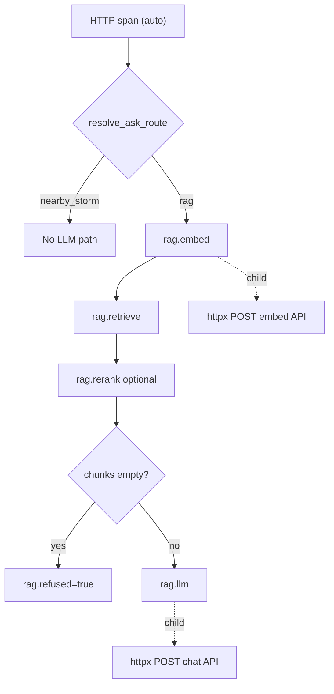

# OpenTelemetry tracing — learning notes

This doc explains **why** we instrumented the RAG pipeline the way we did, and how the pieces connect. Read it alongside the code in [`app/monitoring/tracing.py`](../app/monitoring/tracing.py) and the ask handlers in [`app/main.py`](../app/main.py).

## Metrics vs traces (both, on purpose)

| Signal | Question it answers | Verbiage home |
|--------|---------------------|---------------|
| **Metrics** (Prometheus) | "What is p95 embed latency across all traffic?" | [`app/monitoring/metrics.py`](../app/monitoring/metrics.py) |
| **Traces** (OpenTelemetry) | "Why was *this* `/ask` slow?" | [`app/monitoring/tracing.py`](../app/monitoring/tracing.py) |

We did **not** replace Prometheus. Histograms like `rag_phase_seconds` stay the source of truth for dashboards and alerts. Traces add a **per-request span tree** you can inspect in Grafana Explore when debugging one bad request.

## The RAG pipeline (what we trace)

Both `/ask` and `/ask/stream` follow the same phases — see `_retrieve_for_ask` and the ask handlers in [`app/main.py`](../app/main.py):



**Why these boundaries?** They match the existing `record_rag_phase_seconds("embed"|"retrieve"|"llm", ...)` calls. Same seams = metrics and traces stay comparable.

## Design decisions

### 1. `OTEL_ENABLED` defaults off

Tests and production without a collector should pay **zero** export cost. Same pattern as `METRICS_ENABLED` in [`app/config.py`](../app/config.py).

### 2. Auto-instrument FastAPI + httpx; manual spans for RAG phases

- **FastAPIInstrumentor** — creates the parent HTTP span (`POST /ask`) with route template labels. You don't maintain this by hand.
- **HTTPXClientInstrumentor** — creates child spans for OpenAI/Ollama HTTP calls inside [`app/llm_client.py`](../app/llm_client.py) and embedders **without editing those files**. High learning value, minimal diff.
- **`rag_phase_span()`** — manual spans for domain-specific phases Prometheus already names. Only RAG code knows about retrieve modes, relevance gates, and rerank.

### 3. Span names mirror Prometheus phase labels

| Span | Prometheus `phase` label |
|------|--------------------------|
| `rag.embed` | `embed` |
| `rag.retrieve` | `retrieve` |
| `rag.rerank` | (no separate metric yet — nested under retrieve timing) |
| `rag.llm` | `llm` |

When you see a spike in `rag_phase_seconds{phase="llm"}`, search Tempo for traces with a long `rag.llm` child span.

### 4. Low-cardinality attributes only

We attach **outcome metadata**, not content:

| Attribute | Meaning |
|-----------|---------|
| `rag.endpoint` | `sync` or `stream` |
| `rag.route` | `rag` or `nearby_storm` |
| `rag.retrieval_mode` | Resolved mode (`hybrid`, `vector`, `lexical`) — not raw `auto` |
| `rag.auto_routed` | Whether `auto` mode picked lexical vs hybrid |
| `rag.chunk_count` | Chunks after retrieve (before prompt trim) |
| `rag.top_cosine` | Best cosine when available (gate signal) |
| `rag.gate_blocked` | Relevance gate cleared chunks |
| `rag.refused` | Fixed no-context reply returned |

**Never on spans:** question text, chunk content, doc IDs — PII risk and cardinality explosion in Tempo.

### 5. Collector in front of Tempo

```
Verbiage → OTLP :4318 → OTel Collector → Tempo :4317 → Grafana Explore
```

The app talks to the **collector**, not Tempo directly. Collectors batch, retry, and can fan out to multiple backends later (Jaeger, cloud vendors) without changing app code.

### 6. `BatchSpanProcessor` vs `SimpleSpanProcessor`

- **Production / app:** `BatchSpanProcessor` — buffers spans, exports in background so OTLP never blocks request handling.
- **Tests:** `SimpleSpanProcessor` + `InMemorySpanExporter` — synchronous, no network. See [`tests/test_tracing.py`](../tests/test_tracing.py).

### 7. Log correlation (TraceContextFilter)

When tracing is on, log records get `trace_id` and `span_id` fields. Future step: ship logs to Loki and jump from a trace to matching log lines in Grafana.

## Code map

| File | Role |
|------|------|
| [`app/monitoring/tracing.py`](../app/monitoring/tracing.py) | SDK setup, `rag_phase_span`, attribute helpers |
| [`app/main.py`](../app/main.py) | `init_tracing` in lifespan; spans on ask paths |
| [`app/monitoring/metrics.py`](../app/monitoring/metrics.py) | Unchanged Prometheus helpers (kept alongside traces) |
| [`observability/docker-compose.yml`](../observability/docker-compose.yml) | Collector + Tempo + existing Prometheus/Grafana |
| [`observability/otel-collector-config.yaml`](../observability/otel-collector-config.yaml) | OTLP in → Tempo out |

## Local workflow

1. In `.env`:
   ```bash
   OTEL_ENABLED=true
   OTEL_SERVICE_NAME=verbiage
   OTEL_EXPORTER_OTLP_ENDPOINT=http://localhost:4318
   METRICS_ENABLED=true   # optional but nice to compare both signals
   ```
2. Restart the API on `:8000`.
3. `cd observability && docker compose up -d`
4. Ask a question in the app.
5. Grafana → **Explore** → datasource **Tempo** → Search → `{resource.service.name="verbiage"}`.
6. Open a trace: you should see `POST /ask` → `rag.embed` → httpx child → `rag.retrieve` → optional `rag.rerank` → `rag.llm` → httpx child.

## Phase 2 ideas (not implemented yet)

- **Ingest/indexing** spans in [`app/indexing.py`](../app/indexing.py) (`chunk`, `embed`, `persist`).
- **Report Writer** LangGraph node spans in [`app/report_writer/`](../app/report_writer/).
- **Trace exemplars** linking Prometheus histogram buckets to trace IDs.
- **Frontend** trace propagation (`traceparent` header from the React SPA).

## Further reading

- [OpenTelemetry Python docs](https://opentelemetry.io/docs/languages/python/)
- [Grafana Tempo](https://grafana.com/docs/tempo/latest/)
- Verbiage metrics runbook: [`observability/README.md`](README.md)
